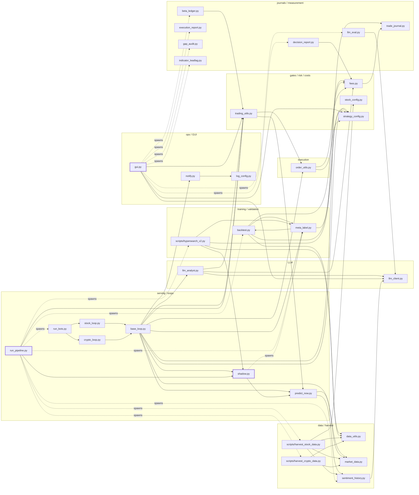

# trader — the repository map

**What this is.** The one document that explains how this repository is laid out, how the system
works end to end, how the pieces fit together, what the project is ultimately for, and what each
piece is for — written so that a future agent (or the owner, months from now) can locate anything
and improve it without re-deriving the design. It is the narrative companion to `CLAUDE.md`
(how to run and test) and `research/AGENT_CONTEXT.md` (how to behave here).

**Who it is for.** Future agents first, the owner second. Read `research/AGENT_CONTEXT.md` (2 min),
then this file, then the doc that *owns* the fact you need.

**One home per fact.** This map points; it does not restate numbers. Owners:

| Fact | Owner |
|---|---|
| how to run / test, the two-machine table, the numbered gotchas, the suite baseline | `CLAUDE.md` |
| per-module goal, API, imported-by, CLI flags (every `add_argument`) | `docs/MODULES.md` |
| every flag / constant / env var, default, reader, facing, test pin | `docs/FLAGS.md` |
| every generated / runtime file, writer, readers, machine, ignore status | `docs/STATE_FILES.md` |
| vocabulary | `docs/GLOSSARY.md` |
| the mechanical import/process graph and its invariants | `docs/graphs/README.md` + `scripts/repo_graph.py` |
| scripts, tests, research record, Claude Code assets, assets, archive | the README in each directory (§11) |
| what must never be rebuilt | `research/KILL_LIST.md` |
| how to activate anything on the Jetson | `research/campaign_2026-08/03_jetson_runbook.md` (+ `06_signal_model_plan.md` §4) |

**As of.** 2026-09-08, HEAD `20a41db` plus the owner's uncommitted R2 / R3 / IA-1..4 work (§8).
Line numbers quoted below are snapshots of that tree; function anchors (`file.py:function`) are the
durable form. **Keep it current:** regenerate the graph with `python3 scripts/repo_graph.py --json
--summary`; regenerate the flag and state-file censuses with the recipes at the end of
`docs/FLAGS.md` and `docs/STATE_FILES.md`; when a claim here goes stale, fix it here *and* in the
owning doc, never in a third place.

---

## 1. The ultimate goal — and the honest distance from it

**The goal, in the owner's own priority order** (`CLAUDE.md` § Conventions → Effort):
**Jetson 8 GB memory/perf › financial soundness › LLM utilization › trading strategy.**

Spelled out: an **autonomous, honest, self-measuring trading system** that

1. runs unattended, 24/7, on an NVIDIA Jetson Orin Nano (8 GB unified memory) — training on the
   GPU one process at a time, trading on the CPU continuously, surviving thermal throttling, crashes
   and restarts without human hands (`run_pipeline.py`, systemd `Type=notify` + watchdog);
2. trades **two books** through the Alpaca API — crypto (24/7) and US stocks (regular trading hours)
   — each with **one** forecaster: a RegressionLSTM blended with a LightGBM leg, producing
   multi-horizon hourly return forecasts (today: paper account; the design target is a live-capable
   system, which is why every live path fails closed);
3. admits a trade **only** through a cost-aware, meta-labeled, risk-capped gate stack, so that the
   book pays for edge it can measure rather than for activity;
4. promotes a model **only** through honest validation — purged walk-forward with embargo, an
   untouched holdout, Deflated Sharpe (`DSR_MIN=0.60`), a policy-replay gate that reruns the *real*
   exit stack, then a live champion-vs-challenger shadow test (DM-HLN) — so backtest numbers mean
   something;
5. **measures itself continuously** — decision journals, realized-beta ledger, LLM scorecard, sizing
   co-fire, indicator lead/lag, retrain-gain ledger, Stage-0 prediction dumps — so that every
   strategy change is an *evidence-gated flag flip*, never an opinion;
6. uses LLMs as **bounded, fail-open advisors** (veto / size-tilt / advisor dossiers) at a $1/day hard
   cap, with the product goal of working at **$0** (free-first) once the free tiers qualify;
7. keeps **train / serve / backtest parity** and **point-in-time discipline** sacred, because
   without them items 3–5 are theatre.

**What "done" would look like.** The 12-step Jetson experiment sequence (§8) executed; the
evidence-gated flags in the runbook flipped or retired on their measurements; a realized-beta
ledger showing alpha that survives its own t-stat; the LLM spend justified by `llm_eval.py`'s `b2`
verdict (or switched off, or switched to a qualified free provider); the unwired kernels either
activated on their co-fire counterfactuals or retired to `archive/`; and the two live loops' exit
mirror reconciled with the shared kernel. None of that can be settled on the dev Mac — it needs the
Jetson, real journals and calendar time.

**The honest distance (verified, not marketing).**

- The 2026-07 six-agent review's verdict still stands: the deployed policy is a **gated,
  conditional-beta, long-only book** — six correlated cryptos plus the top-7 of ~45 hand-picked
  high-beta stocks, so ~85–95 % of invested variance is factor variance; the ladders (trend, VIX,
  drawdown) are conditional beta timing; **+EV is unproven** (the validation agent's honest posterior
  on a full gate pass was ~40–55 %). The reliably +EV content today is *cost engineering* (maker
  ladders, IOC caps, per-name EDGE spreads) and *loss avoidance* (the gate stack).
- The 2026-08 campaign, the R2 signal-model round and the IA-1..4 decision-influence
  implementation **built the instruments, the flags and the plans**; they did not (and could not,
  from the Mac) produce the evidence. Every model-facing change from them ships **default-OFF**
  with a byte-pinned OFF path (`docs/FLAGS.md`).
- Known structural facts a future agent must not paper over: the live exit stack is a hand-written
  *mirror* of the shared kernel, not the kernel (§4f); two training-objective defects (L1, L2) are
  still on the default path behind `TRAINING_REPAIRS_V1` (§4b); the production validation stack is
  narrower than the docs long implied (CSCV-PBO, Lo-2002 and the stationary bootstrap have no
  production caller — §4b); the shipped LLM default is paid Anthropic, not free (§9); seventeen
  flags are declared ahead of any reader (§9).

---

## 2. The system on one page

**Two books, one engine.** `crypto_loop.py` and `stock_loop.py` subclass `base_loop.BaseTradingLoop`
(Template Method): the base owns the cycle, the exit stack, the prediction fan-out, the gate funnel,
sizing and journaling; the subclasses own hours, universe, order tactics and book-specific gates.
`run_bots.py` hosts both loops as threads in one process (saves ~0.5–0.8 GB of duplicate torch/pandas
on the Jetson); `run_pipeline.py` orchestrates everything above them.

**One forecaster per book.** `scripts/hypersearch_v2.py` (Optuna TPE, purged calendar walk-forward,
holdout DSR gate) writes a `{prefix}model_v2.*` artifact stack — RegressionLSTM (`model_v2.py`),
LightGBM mean + q10 boosters (`model_lgb.py`), scaler, feature list, manifest. `predict_now.py`
serves the blend `lstm_weight·LSTM + (1−w)·LGB` (`config['lstm_weight']`, default 0.6) plus a q10
tail veto and an indicator snapshot, from *closed* bars only, through the same feature functions the
harvest used. The old dual bear/bull ensemble is gone; "bear/bull" survives only as regime
diagnostics and the champion/challenger slot names.

**The gate stack (per candidate, in order).** cooldown → hard-stop lockout → daily trade budget →
position cap → prediction present → quote present → **cost gate** (`order_utils.should_trade` →
`fees.required_edge_pct`) → threshold → winner's-curse → correlation → VIX halt / VIX-25 block (stocks)
→ sentiment *multiplier* → **LLM veto** (`s < 0.15`) → **meta-label veto** (`p < 0.30`) → q10 tail
veto → sizing (`_compute_position_size`: risk base → Kelly → vol target → tilt product → ENB
book-risk budget → hard caps). Stocks add sector-bucket, earnings, EDGAR, SPY-trend and entry-window
gates and iterate only the top-7 by rank. Every priced veto journals a `skip` row (§4e).

**Validation → promotion.** trainer holdout gate (`n_eff`-deflated DSR ≥ 0.60) → `backtest.py
--gate` policy replay (`n ≥ 10 ∧ Sharpe > 0 ∧ DSR ≥ 0.60`, rollback to `.prev` on failure) →
challenger slot → hourly shadow predictions → daily DM-HLN evaluation → `shadow.promote_challenger`
(manifest written last) → the running bots hot-reload on the manifest mtime (§4c–d).

**The measurement loop.** Every decision — taken or skipped — lands in `journals/YYYY-MM-DD.jsonl`
(`trade_journal.log_decision`); completed round trips in `trade_memory.json`; predictions in
`{p}pred_history.jsonl` (PSI drift) and `{p}shadow_preds.jsonl`. Offline instruments read them:
`decision_report.py` (gate attribution + conviction calibration), `beta_ledger.py`, `llm_eval.py`,
`execution_report.py`, `scripts/sizing_cofire_report.py`, `retrain_ledger.py`, plus the Stage-0
dumps (`{slot}_stage0_preds.json`) that `scripts/ic_by_name.py`, `rank_gradient_report.py`,
`naive_vs_blend.py`, `horizon_transfer_report.py`, `entry_timing_probe.py`, `funding_drift_audit.py`
consume (§4g).

**Two machines.** The dev Mac (py3.13, no torch/lightgbm/optuna/joblib/numba/sklearn/dotenv/alpaca/
PySide6/pyarrow/arch/hmmlearn) can build and prove pure-algorithm code on synthetic data; the Jetson
(py3.10, full stack) does training, harvest, live trading, GUI and every measurement that needs real
journals. The Mac↔Jetson sync is the owner's, not the repo's (§7).

**The main flow, mechanically.** Solid arrows are imports; dashed arrows are OS child processes
(from the command literals in `run_pipeline.py`, `gui.py`, `shadow.py`). The full graph, fan-in/out
tables and the `--check` invariant live in `docs/graphs/README.md`.



Reading it: `run_pipeline.py` is the only node that spawns the *training* chain (harvest →
hypersearch → meta_label → backtest --gate) and the *serving* chain (run_bots / the loops) — those
are separate OS processes, which is why its import fan-out (10) understates its role. `base_loop.py`
has the largest import fan-out (28) but spawns nothing: it is the in-process core both loops inherit.
`strategy_config.py` (fan-in 21 + 32 test modules) and `log_config.py` (22) are the two universal
leaves.

---

## 3. Layout — what lives where, and why

```
trader/
├── *.py  (91 modules, flat)      the system: config, kernels, features, models, gates, loops, ops, GUI
├── scripts/                      CLIs the pipeline spawns + measurement/research drivers + shell setup
├── tests/                        200 pytest modules (+ conftest, baseline_failures.txt) — flat, one family per campaign
├── docs/                         THIS map + the reference censuses (MODULES, FLAGS, STATE_FILES, GLOSSARY, graphs/)
├── research/                     the project's research record (waves, reviews, literature, the 2026-08 campaign, KILL_LIST)
├── archive/                      moved-not-deleted: stale scratch / run configs / dev-Mac residue, each with a README row
├── .claude/                      Claude Code assets, COMMITTED: skills, workflows, hooks, agents, settings.json
├── .github/workflows/ci.yml      two CI legs (py3.10 jetson-parity, py3.12 modern)
├── fonts/  logos/                GUI assets (fonts: 3 TTF; logos: 12-theme PNGs + 96 px thumbnails)
├── journals/  logs/              RUNTIME, gitignored: decision journals; rotating trader.log
├── CLAUDE.md  README.md          operational truth; human orientation
├── requirements*.txt             desktop / CI (Jetson-parity) / Jetson pins
├── pyproject.toml                pytest config only (testpaths=tests, -v --tb=short)
└── stock_universe.json           the only committed data file (the stock universe seed)
```

| Directory | Goal | Its README owns |
|---|---|---|
| root `*.py` | the whole runtime and research surface, flat (see "why flat" below) | `docs/MODULES.md` (per module) |
| `scripts/` | anything run as `python scripts/x.py`: the two harvesters, the trainer, 16 measurement/research drivers, four shell scripts (`setup.sh`, `setup_jetson_system.sh`, `backup_state.sh`, `ab_check.sh`) | `scripts/README.md` — 24-row table: goal · machine · verified flags · reads/writes · plan step |
| `tests/` | the regression suite; families named by campaign prefix (`c26_*`, `r2c_*`, `ia*_*`, `review_*`, `grp_*`, `improve_*`, `llm_*`, core) | `tests/README.md` — baseline explained dep-by-dep, family map, conventions, full per-file inventory |
| `docs/` | reference docs with one owner per fact | `docs/README.md` — index + reading order |
| `research/` | the durable research record. Flat canonical files: `README.md`, `AGENT_CONTEXT.md`, `KILL_LIST.md`, `module_review_2026-07.json` (live `/decision-queue` input). Subdirectories: `waves/` (wave1 eval + waves 2–9), `reviews_2026-07/` (module-improve-v3 batches, GUI review, panel plan), `literature/` (2026-07 econ, 2026-07 + 2026-08 Nobel/modern rounds), `campaign_2026-08/` (docs 01–08 — never renamed: 21 code/test references) | `research/README.md` + one README per subdirectory |
| `archive/` | the delete-nothing rule made concrete: `commit_messages/` (two stale drafts), `claude_workflow_runs/` (a never-run batch-B5 config), `local_residue/` (dev-Mac test residue, gitignored) | `archive/README.md` — origin · tracked? · why · date · safe-to-restore |
| `.claude/` | skills `/regression-ab` `/decision-queue` `/improve` `/panel-improve`; workflows `group-improve-v2.js`, `module-improve-v3.js` (+ `*.example.json`); the blocking py-compile PostToolUse hook; `agents/fable-high.md`; `settings.json` (permissions) | `.claude/README.md` |
| `logos/`, `fonts/` | GUI theme art (62.7 MB of full-size PNGs = 88 % of tracked bytes; the code prefers `logos/96/`) and three TTFs | `logos/README.md`, `fonts/README.md` |
| `journals/`, `logs/` | runtime only; created by `trade_journal.open_journal` / `log_config._setup` | `docs/STATE_FILES.md` §5, §10 |

**Why the root is flat — and why this pass left it flat.** Ninety-one modules at the root is not a
package layout; it is the layout every Jetson command, systemd unit, `Popen` literal in
`run_pipeline.py`, and 200 test modules assume. `tests/conftest.py` puts both the root and
`scripts/` on `sys.path` (which is why a test can write `import harvest_stock_data` bare — there are
zero stem collisions, verified by `scripts/repo_graph.py`). Every module imports its siblings by bare
name; there are no packages and no relative imports. Turning this into `trader/{config,data,
features,models,gates,loops,exec,ops}/` would touch ~300 import edges, every `Popen` literal, the
systemd unit, the CI `py_compile` globs, the source-text contract tests that `read_text()` modules
by path, and the owner's Jetson muscle memory — a behavior-preserving refactor, but not an
*objective fix*, and impossible to verify from the Mac (a third of the top layer cannot be imported
here, §7). It is therefore an **owner decision**, recorded here rather than done. If the owner takes
it, the mechanical layer order in `docs/graphs/README.md` (depth 0 config/kernels → depth 9
`run_bots`) is the package boundary that the import graph already supports.

**How to find a module by role without the package structure:** `docs/MODULES.md` groups all 113
analysed modules into the same 16 subsystems used in §5 below, and its index table is sortable by
subsystem; `docs/graphs/README.md` lists them by mechanical depth.

**What is committed vs generated** (authoritative table: `docs/STATE_FILES.md`; summary in
`CLAUDE.md` § What's committed vs generated): code, docs, research, tests, `.claude/`, assets,
requirements and `stock_universe.json` are versioned; models (`*.pth`, `*.pkl`, `lgb_*.txt`,
manifests), Optuna study DBs, training parquet/CSV, archives, journals, logs, caches, reports,
locks, `llm_config.json` (holds keys), `indicator_config.json`, `.env`, and every `*.prev` are
local. The 2026-09-08 pass added 20 ignore patterns for generated files that had none (the champion
halves of the artifact stack among them) and `.claude/workflows/*.run.json`.

---

## 4. How it works — the lifecycle

Everything below runs on the Jetson (`run_pipeline.PYTHON` is the Jetson conda interpreter,
`run_pipeline.py:44`); the Mac can only read it and test the pure kernels. The process tree:

```
systemd trader.service (Type=notify, WatchdogSec=900; scripts/setup_jetson_system.sh)
  ExecStart: python -u run_pipeline.py --combined-bots --bot-only
  └─ run_pipeline.py  — orchestrator (one main thread + a heartbeat daemon thread)
       ├─ phase subprocesses, sequential, cwd=BASE_DIR:
       │    scripts/harvest_crypto_data.py · scripts/harvest_stock_data.py
       │    scripts/hypersearch_v2.py --trials N --preset stationary --no-status [--mode …] [--shadow] [--prefix stock …]
       │    meta_label.py [--prefix stock]
       │    backtest.py [--prefix stock] --days 44|60 [--trials N] --gate [--model-prefix …challenger]
       ├─ background: sentiment_history.py --fetch-stocks (once) · --backfill (after launch)
       └─ bots, CPU-only env (CUDA_VISIBLE_DEVICES='' , OMP/TORCH_NUM_THREADS=2):
            run_bots.py [--crypto-only|--stock-only]  (combined)   OR   crypto_loop.py / stock_loop.py (split)
              └─ threads crypto-loop / stock-loop (+ ops thread) → base_loop.BaseTradingLoop.run
```

### 4a. Harvest → `*training_data.{parquet,csv}`

`scripts/harvest_crypto_data.py` and `scripts/harvest_stock_data.py` (no argparse; spawned by
`run_pipeline._build_harvest_phases`, skipped when the store is < 24 h old unless forced) build the
two feature stores that every model, gate and backtest downstream is trained on. The steps, per book:

1. refresh the free archives (`funding_archive.sync`, `oi_archive.sync` for crypto; `short_flow.sync`
   for stocks) — idempotent, capped, back-filling;
2. fetch hourly bars with provenance: crypto merges Alpaca (primary) + yfinance (last ~730 d) via
   `data_sources.fetch_with_fallback` (CryptoCompare is inert — keyless 401); stocks use yfinance as a
   *fallback only* because its hourly bars are :30-aligned against Alpaca's :00
   (`data_sources.py:168-186`), with a merge guard that refuses an incremental merge whose 48 h
   overlap diverges > 1 % (split/adjustment drift);
3. compute features with **the same functions live serving calls** — `indicators.compute_features` /
   `compute_stock_features` (called at `predict_now.py:287` on the live side), then `fill_warmup_features`
   with the same neutral fill; merge point-in-time archive features (funding, OI, top-trader L/S,
   taker imbalance; FINRA short-volume for stocks); optional DARK stamps (`liquidity.stamp_crypto_spreads`,
   `cost_regime.stamp_cost_regime_features`, both default OFF); stocks stamp a strictly-trailing
   per-name `Eff_Spread_Pct` from `liquidity.edge_spread_series` (bidask EDGE, 35-bar, clipped);
4. apply the **as-of masks** (stocks): a per-ticker tradability floor (`_DV30 ≥ $5M`, `Close ≥ $3`)
   and a cross-sectional membership mask keeping the as-of top-60 by 30-day dollar volume — this is
   where survivorship is removed, not in `stock_config`; then `panel_ranks.add_panel_ranks` adds the
   20 `CS_*` columns and drops the raw dollar-volume so only the *rank* is a feature;
5. **labels**: `Target_Return_{fb}` (hold-exactly-fb) for each `fb` in the adaptive `FORWARD_BARS`,
   and the triple-barrier set `TB_Ret_{fb}` / `TB_Bars_{fb}` / `TB_Reason_{fb}` from
   `policy_exits.compute_tb_labels` — **the same Numba exit-stack kernel the backtester and the
   meta-labeler run** (§4f); `Daily_Sentiment` from `sentiment_history` (stock side lagged one day;
   crypto Fear & Greed unlagged because it is stamped at 00:00 UTC of its publication day);
6. `data_utils.save_training_data` (parquet + CSV, atomic) → `validate_training_data`.

The **feature catalogue** (63 stock columns, pinned by the golden fingerprint in
`tests/test_indicators_parity.py`) and the PIT status of each family are in `docs/MODULES.md` §3 and
the harvest agents' catalogue; the indicator **preset** actually trained in production is
`stationary` — `run_pipeline.py` hardcodes `--preset stationary`, overriding the GUI-editable
`indicator_config.json` (a manual `hypersearch_v2.py` run honors the picker; the pipeline does not).

### 4b. Train + certify (`scripts/hypersearch_v2.py`)

- **Data path.** `load_data` → `data_utils.load_training_data` (the book is chosen by `'stock' in
  --data`, not by `--prefix`); labels `Target_Return_{fb}` + optional `TB_Ret_{fb}` (`target_kind` is
  itself searched); features = every numeric column minus labels/ids/`Eff_Spread_Pct`, filtered to the
  preset; rows laid out as contiguous per-ticker blocks; the LSTM window is `arange(-seq_len, 0)` —
  it **excludes the entry bar** (defect M1, measure-first via `scripts/entry_timing_probe.py`).
- **Holdout pin.** `objective_utils.holdout_boundary`: default the (1 − 0.12) quantile of pooled
  timestamps; `FIXED_HOLDOUT_DAYS` / `TRADER_FIXED_HOLDOUT_DAYS` pins it to `max(t) − days`. Every
  consumer — folds, refit purge, LGB refit, blend guard, OOF pack, certificate — inherits that one
  boundary.
- **Folds / purge / embargo.** `get_walk_forward_folds`: three expanding folds over the search region;
  purge keeps a train row only if its *label-completion time* ≤ train end; embargo = `seq_len ×
  EMBARGO_MULTIPLIER` calendar hours (≈ 11 RTH bars on stocks — defect L6; the bars-based
  `objective_utils.embargo_end_time` sits behind `TRAINING_REPAIRS_V1`); a `RobustScaler` fitted on
  the fold's TRAIN rows only, one scaled matrix cached at a time (`ScaledCache`, Jetson memory).
- **The objective Optuna optimizes.** Per trial: `forward_bars`, `seq_len`, `hidden_dim`, layers,
  heads, dropout, lr, batch, weight decay, `huber_delta`, `trade_threshold`, scheduler,
  `target_kind`. Per fold: RegressionLSTM + weighted Huber, AMP, grad-clip, an OOM probe batch,
  early stop on validation loss, a K=4 checkpoint "soup". **Score = mean(fold Sharpe) − 0.5·std**,
  × 0.7 if the best fold's worst regime Sharpe < −0.5. Sharpe comes from a non-overlapping hold walk
  (`objective_utils.simulate_trades_core`) charged `TXN_COST_PCT`, and — because
  `OBJECTIVE_LONG_ONLY=False` — **still scores a short leg the live book never takes**.
  Two defects remain on the default path and are repaired only under `TRAINING_REPAIRS_V1`: **L1**
  (validation loss ignores `huber_delta` and the sample weights, `hypersearch_v2.py:1057`) and **L2**
  (regime-penalty look-ahead, `:643-653`). Seeds are opt-in (`TRAINER_SEED`).
- **Certification.** The holdout report (`evaluate_on_holdout`): policy Sharpe, `n_eff` (legacy:
  the harsher of per-ticker average-uniqueness and calendar-clustered; gate v2:
  `sample_weights.calendar_effective_n`, Kish ρ optional), the deflation pool (`n_trials` = COMPLETE
  trials, or `adaptive_config.overlap_weighted_trials` / `cum_trials` under `PROMOTION_GATE_V2`),
  then `validation.dsr_from_trade_returns` → **`gate_ok` = Sharpe > 0 ∧ DSR ≥ `DSR_MIN` (0.60)**.
  Wired *and consumed*: DSR, the score ratchet (`adaptive_config.noisy_ratchet` under v2). Wired but
  **print-only**: coarse `pbo_from_fold_scores`, a bootstrap of trial scores, param importance.
  **Not wired at all** (tests only): `validation.pbo_cscv`, the Lo-2002 serial factor (off by
  design — gotcha #4), `stationary_bootstrap_sharpe_pvalue`. This is narrower than older docs
  implied; say so when you cite "CSCV-PBO".
- **cert == deploy (R2C-02, V3 path).** `blend_fit.effective_lstm_weight` resolves a failed/absent
  blend fit to the same `DEFAULT_LSTM_WEIGHT=0.6` for both the certificate and the shipped config;
  the holdout-crossing rows are purged before the blend fit; stale-vs-refit weights and the
  blend-reselected threshold are recorded in `config['blend_diag']` and only *deployed* under
  `BLEND_FIT_ON_REFIT` / `BLEND_THRESHOLD_RESELECT`. The certificate carries `sharpe, dsr, n_trades,
  n_eff, min_trl, n_trials_pool, hit_rate, pred_deciles`, and for a blended certificate `lstm_weight`,
  `q10_vetoed`, `cs_rank_ic{lstm,lgb,blend}`.
- **Artifacts** (all `{p}` = `''` / `stock_` / `challenger_` / `stock_challenger_`; full table with
  every reader in `docs/STATE_FILES.md` §1): `model_v2.pth`, `config_v2.pkl` (the certificate lives
  inside it under `holdout`), `scaler_v2.pkl`, `feature_cols_v2.pkl` (the parity contract),
  `oof_preds.npz` (purged fold-val predictions, fingerprinted), `lgb_model.txt`, `lgb_q10.txt` +
  `lgb_q10_meta.json`, `.prev` copies of the outgoing stack, `hypersearch_{p}v2_log.json`,
  `{p}v2_study.db`, `adaptive_state_{book}.json` (best score, search space, `cum_trials`, ledger),
  and — written LAST, because its mtime is the hot-reload key — `{p}model_v2.manifest.json`.
- **`--shadow`.** If a champion manifest exists, the whole stack is saved under the *challenger*
  prefix instead; the champion is untouched. `run_pipeline` passes `--shadow` only on retrains
  (never on the initial run), unless `TRADER_SHADOW_MODE=0`.
- **Gotcha #2** (`CLAUDE.md`): after any objective/feature change delete `v2_study.db` +
  `stock_v2_study.db` and reset the adaptive `best_score` — old Optuna scores are incomparable.

### 4c. The promotion gate (`backtest.py --gate`)

`run_pipeline` runs it after each book's training + meta phase (crypto `--days 44`, inside the ~12 %
holdout; stock `--days 60`). `run_backtest` replays the last N days of the book's training frame with
the saved stack through `simulate_ticker` — the shared exit kernel with `max_hold=0, use_signal_exit=True`,
the two-tier cost model (flat spread for the admission floor, per-bar `Eff_Spread_Pct` for charged
P&L), the meta veto via `meta_label.predict_meta_array`, the q10 veto — pools every trade, and passes
iff **`n_trades ≥ 10 ∧ Sharpe > 0 ∧ DSR ≥ DSR_MIN`** (`backtest.py:1320-1322`, as of 2026-09-08).
Exit code **3** is a deterministic policy rejection that `run_pipeline` never retries and never lets
abort the other book; it covers three outcomes: (i) legacy target → `restore_previous_model` renames
the twelve `.prev` legs back (manifest last) = `gate_failed_rolled_back`; (ii) challenger target
(only under `GATE_TARGETS_CHALLENGER`) → the challenger is HELD and `{slot}_policy_gate.json` is
written for `shadow._gate_preflight`; (iii) a fallback-champion replay whose `.prev` exists → the
established champion is held, nothing restored. Every run also writes `backtest[_slot]_report.json`
and — by default — the Stage-0 dump `{slot}_stage0_preds.json`; `--fee-mult` / `--fee-sweep` produce
the λ* cost-headroom reports (report-only, refused together with `--gate`).
**Structural caveat** (documented in the module docstring): under the default shadow mode the gate
replays the **champion** while the fresh model sits in the challenger slot ungated — unless
`GATE_TARGETS_CHALLENGER` is ON.

### 4d. Champion / challenger / shadow, DM-HLN, and the two kinds of "reload"

- **Slots.** champion = `{p}model_v2.*`; challenger = `challenger_*` / `stock_challenger_*`
  (`shadow.challenger_prefix`, `champion_exists`). Artifact stack `shadow._ARTIFACT_SUFFIXES` (eight
  files) + the manifest; the meta triple is stashed to `*.stale` on promotion.
- **Hourly shadow rows.** `shadow.maybe_log_shadow` (called from the bot cycle every
  `SHADOW_LOG_INTERVAL_SEC=3590`) loads the challenger stack keyed on its manifest mtime and appends
  `{ts, sym, champ, chall, fb_champ, fb_chall, cm}` to `{p}shadow_preds.jsonl`.
- **Daily evaluation.** `run_pipeline._maybe_run_drift_check` (once per calendar day) runs
  `monitor_drift.run_check` for both books, then `shadow.evaluate_and_maybe_promote`:
  `evaluate_shadow` realizes each row's forward return on its own horizon from closed bars,
  forms the variance-normalized squared-error difference `d`, and tests it with `shadow.dm_hln`
  (Diebold-Mariano with the Harvey-Leybourne-Newbold correction). Legacy decision: promote if
  `n ≥ 200 ∧ age ≥ 14 d ∧ p < 0.05`; at ≥ 28 d promote if `n ≥ 200 ∧ mean d > 0 ∧ p < 0.10`, else
  discard. `TRADER_SHADOW_DM_V2=1` lets the side-by-side v2 verdict decide; `GATE_TARGETS_CHALLENGER`
  adds the policy-gate preflight. Every evaluation writes `{p}shadow_status.json`; terminal decisions
  append to `{p}promotion_ledger.jsonl`.
- **Promotion.** `shadow.promote_challenger`: `.prev` backups of every champion artifact → copy the
  challenger over → rewrite `config['prefix']` → stash the stale meta triple → **write the manifest
  last** (tmp + `os.replace`, with `promoted_from_shadow` + the shadow report) → background
  `meta_label.py [--prefix]` retrain → discard the challenger files and its shadow rows.
- **Hot-reload (daily promotion, bots running).** `base_loop._hot_reload_check` compares
  `trading_utils.model_reload_key(prefix)` — the manifest mtime (`.pth` fallback) — each cycle;
  on change it reloads the LSTM stack via `predict_now.load_models`, pops the booster caches, and the
  mtime-keyed `serving_cache.cache_get` reloads `lgb_model.txt` / `lgb_q10.txt` when *their* files
  change (300 s backoff on a failed key). `serving_cache.py` is the R2C-01 fix for the **champion
  serving race**: legacy retrains wrote the manifest *before* the boosters finished, so
  presence-keyed caches pinned last week's boosters (trained against the previous scaler) for up to
  a week.
- **The weekly retrain is a COLD restart, not a hot reload.** `run_pipeline` calls `_stop_bots`
  before `_run_training(..., is_retrain=True)` and `_restart_bots` after (`run_pipeline.py:1790`,
  `:1809`); the bots re-read the champion slot at startup (`base_loop._load_models`). The phrase
  "hot-reload, bots never stop" that older docs used describes the *daily shadow promotion*, not the
  weekly retrain. During the retrain the books are unmanaged (the crypto book for the whole
  multi-hour GPU run — a known Jetson-scheduling cost).
- **Bot process modes.** The systemd unit runs `--combined-bots` (one `run_bots.py` process, tracked
  by `run_pipeline` under the name `'Bots'`); `run_pipeline`'s own default is split (one process per
  book). Known consequence: `_update_per_bot_status` only checks the `'Crypto'`/`'Stock'` names, so
  in combined mode `pipeline_status.json` reports every bot as not running (GUI + Telegram `/status`
  consumers) — owner decision, §9.

### 4e. One decision cycle per bar (`base_loop._run_one_cycle`)

`BaseTradingLoop.run`: start the optional order stream (`TRADER_ORDER_STREAM=1`) → `_load_models`
(a missing artifact ⇒ model `None` ⇒ **buys fail closed**) → cancel stale open orders →
`_reconstruct_positions` from `{stock_}position_state.json` (HWM, trailing state, cooldowns, daily
budget, peak equity, entry timestamps; then the book's `_replace_protective_stops`) → forever:

| # | Step | Function | Notes |
|---|---|---|---|
| 1 | remote flatten | `_check_flatten_request` | before the hours gate so a stock book can liquidate off-hours; `flatten_{book}.flag`, `notify` kill switch |
| 2 | market hours | `check_market_hours` | crypto always open; stock uses the Alpaca clock (60 s cache, wall-clock fallback) |
| 3 | circuit breaker | `_circuit_breaker_check` | account-wide 5 % daily drawdown vs `last_equity` (`BREAKER_PER_BOOK` OFF); API error ⇒ buys suspended (fail closed); trip ⇒ flatten + halt until the next baseline reset |
| 4 | EOD | `flatten_before_close` | stock only: flatten within 10 min of close, overnight-sleeve keepers get GTC stops |
| 5 | **exits** | `_manage_stops` | the exit stack (§4f), deliberately before hot-reload/maintenance |
| 6 | hot reload | `_hot_reload_check` | manifest mtime (§4d) |
| 7 | every 10th cycle | `_update_macro_regime` · `_update_equity` · `_update_correlations` · `_record_account_risk` | macro also runs the stablecoin-depeg emergency flatten; account risk is journaled, never enforced |
| 8–9 | telemetry, benchmark | GPU temp log; BTC/SPY closes | |
| 10 | **predictions** | `_get_predictions` | thread-pool fan-out of `trading_utils.predict_symbol` with a 45 s timeout — a wedged symbol has no prediction (fail closed); rebuilds the pool ≤ every 600 s; logs predictions for PSI drift; stock override adds the panel pre-pass, top-N / hold-rank hysteresis, RR_5 high-VIX tiebreak |
| 11 | shadow rows | `shadow.maybe_log_shadow` | hourly (§4d) |
| 12 | LLM | `_run_llm_analysis` | throttled `LLM_INTERVAL_SEC=600`; TTL expiry; exponential backoff; journals `llm_analysis` / `llm_backoff` |
| 13 | signal exits | `_execute_sells` | `pred ≤ −threshold` (stock: strict `<`, plus rank-drop below `HOLD_RANK`); never cooldown-gated |
| 14 | LLM veto sells | `_execute_llm_veto_sells` | `s < 0.15` on two consecutive readings |
| 15 | **entries** | `_execute_buys` iff `_buys_allowed` | the funnel below |
| 16–17 | latency row, sleep | `_journal_cycle_latency` · `_sleep` | ×2 interval above `THERMAL_THROTTLE_TEMP=75`, ±5 s jitter |

**Book-level entry gates** (`_entries_allowed`): manual halt (`trading_halt.flag`) → macro stand-down
(`macro_calendar.macro_standdown`: FOMC 12:00–15:30 ET, CPI 06:30–09:30 ET — **no NFP window
exists**, §9) → calendar-exhaustion warning. Both fail *open* on exception. Stocks add: already
flattened today → `_in_entry_window` (`ENTRY_WINDOWS_ENABLED`, silent) → SPY-200d trend computed →
exposure known (else fail closed).

**Per-symbol funnel, in order** (base/crypto iterates the whole universe; stock iterates only
`top_symbols`, rank ≤ `TOP_N=7`, and journals ranks 8–15 once a day as `rank_near_miss`):

| # | Gate | Governed by | Journals |
|---|---|---|---|
| 1 | cooldown `cooldown_ok` | `*_POLICY['cooldown_min']` (crypto 60, stock 20) | veto counter only |
| 2 | hard-stop lockout | `HARD_STOP_LOCKOUT_HOURS=24`, `{stock_}hard_stop_lockout.json` | |
| 3 | daily trade budget | `MAX_TRADES_PER_SYMBOL_PER_DAY`, `TRADE_BUDGET_BACKSTOP` (OFF) | |
| 4 | position cap | `MAX_NOTIONAL_PER_SYMBOL` | |
| 5–6 | prediction / quote present | fail closed | `no_pred`, `no_quote` |
| stock | sector bucket, earnings ≤ 1 d, EDGAR 8-K/M&A | `stock_config.SECTOR_BUCKETS`, `events_calendar`, `edgar_events` (both fail open) | `bucket_cap`, `earnings`, `edgar_event` |
| 7 | **cost gate** `order_utils.should_trade` | `fees.required_edge_pct(live=True)` on the *quoted* spread — the only production `live=True` caller | `cost_floor` |
| 8 | threshold | `config['trade_threshold']` from the certified config | `below_threshold` |
| 9 | winner's curse | price > SMA20 + 2·ATR needs 1.5× threshold | `winners_curse` |
| 10 | correlation | `portfolio.check_portfolio_correlation`; `CORR_FAMILY_MERGED` OFF | `correlation` |
| 11–12 | VIX > 35 halt; VIX > 25 non-safe-haven block (stocks) | `types_mod.MacroRegime`; `VIX25_BLOCK_REMOVED` OFF | `vix_halt`, `vix25_block` |
| stock | SPY < 200 d SMA trend filter (non-safe-haven) | `macro_indicators.get_spy_trend_ok` | `trend_filter` |
| 13 | sentiment | `sentiment.sentiment_gate` — a multiplier in [0.15, 1.5], **never a veto** | folded into sizing |
| 14 | **LLM veto** | `trading_utils.LLM_VETO_THRESHOLD=0.15`; `llm_mult = 0.5 + s` | `llm_veto` |
| 15 | **meta-label veto** | `base_loop._meta_gate` → `meta_label.meta_probability_live`, veto `p < 0.30`, tilt `clip(2p, 0.6, 1.3)`; fail open | `meta_veto` |
| 16 | q10 tail veto | `snapshot['Q10'] < Q10_Floor` from `lgb_q10_meta.json` | `q10_tail_veto` |
| 17 | **sizing** → 0 | `_compute_position_size` (below) | `sizing_zero` |
| 18 | place | crypto: maker bid-join ladder (`MAKER_ENTRIES_ENABLED`); stock: bracket limit with stop + TP legs | `buy` row with the `sizing` decomposition + conviction fields |

**Sizing** (`base_loop._compute_position_size`, one function for both books): emergency zero when the
macro regime says so → risk base `equity · RISK_PCT_PER_TRADE (0.005) / stop_dist`, capped at the
per-symbol notional → Kelly multiplier from `trade_memory` in [0.5, 1.5] (`KELLY_CAP=0.25`,
`KELLY_SAMPLE_GATE` OFF) → GARCH/HAR vol target → the **tilt product** (signal confidence × VIX ladder
× drawdown ladder × macro × correlation × HMM × disagreement × sentiment × LLM × meta × book-specific
extra tilt × book-vol scalar), clamped to [0.1, `TILT_MAX=1.30`], with a degraded-inputs clamp to 0.5
when ≥ 2 advisory feeds are missing → (`DERISK_STACK_V2`, OFF: the regime-family MIN composition,
always computed and journaled as a shadow) → **the ENB book-risk budget** `MAX_BOOK_RISK_PCT=0.025`
via `portfolio.avg_book_correlation` + `portfolio.book_risk_budget` — enforced *here*, in
`base_loop`, not in `portfolio.py` or `risk_budget.py` (which supply the kernels; the cross-book
`ACCOUNT_RISK_CAP` is measurement-only) → hard caps, leveraged-ETF divide, `MIN_ORDER_NOTIONAL=100`.
The known VIX double-count (ladder + macro multiplier) is what the `sizing` journal decomposition and
`scripts/sizing_cofire_report.py` exist to measure.

### 4f. Exits — the kernel, and the live mirror of it

`policy_exits.exit_walk` (Numba, pure-python fallback) is the **one** exit-stack implementation:
hard stop → take-profit → HWM trailing → signal → EOD → vertical barrier, with normative same-bar
precedence rules. It has **four offline consumers** — the harvest labels (`compute_tb_labels`,
`max_hold=fb`), `backtest.simulate_ticker` (`max_hold=0, use_signal_exit=True`),
`meta_label._gen_meta_rows` (same parameters as the backtest) and `decision_report.replay_entry` —
and **zero live consumers**: `tests/test_ia4_flagged.py` pins that no loop imports it. Live exits are
a hand-written mirror: `base_loop._desired_stop_for` (the single stop-math source, also used by the
book-risk cap; its docstring lists the seven hand-duplicated copies of the entry-anchored arithmetic
— an eighth sits in the stock near-miss journal), `_manage_stops` (crypto resting-stop fill detection
→ HWM ratchet on quote *midpoints* → the elif chain hard_stop → take_profit → trailing → **two
consecutive readings** to confirm a breach → crypto `_check_vertical_barrier`, exits only under
`CRYPTO_VERTICAL_BARRIER`), `_execute_stop_exit`, the signal/LLM-veto sells above, and the stock
native trailing-stop upgrade (`stock_loop._manage_stops` upgrades the bracket stop leg to a
`trailing_stop` once price ≥ entry·(1 + ACTIVATE)). So "label == backtest == live" holds **up to the
documented overlay list** in `policy_exits.py` (macro stop tightening, two-reading confirmation,
midpoint vs bar-high HWM, EOD fill timing, TP asymmetries, rank-drop sell, LLM veto, overnight sleeve)
**plus one asymmetry** now documented there: the kernel scales the trail distance by ATR/entry,
`base_loop._desired_stop_for` by ATR/hwm, while `stock_loop`'s native trailing percent agrees with the
kernel — an owner-queue item, not a fix (§9). Both loops read every policy *number* from
`strategy_config` (`CRYPTO_POLICY` / `STOCK_POLICY`), so constants cannot drift; only arithmetic can.

### 4g. Journals and the measurement instruments — what each is FOR

| Instrument | Question it answers | Reads → writes |
|---|---|---|
| `trade_journal.log_decision` | the frozen producer contract: every `skip`/`buy`/`sell`/`entry_window`/`llm_analysis`/`vertical_barrier`/`account_risk`/`cycle_latency`… row | → `journals/YYYY-MM-DD.jsonl` (rotation OFF by default: `TRADER_JOURNAL_ROTATE_DAYS=0`) |
| `trade_memory.record_trade` | the Kelly sample + CUSUM + LLM lesson lines per symbol | → `trade_memory.json` |
| `decision_report.py --days N` | which gate blocked what, at what counterfactual cost (spread-honest replay via the exit kernel), conviction calibration, the `GATE_REASONS` taxonomy; **Stage-0** = this measurement layer | journals → `decision_report.json` |
| `beta_ledger.py` | how much of P&L is SPY/BTC exposure: lagged AKL betas, HAC alpha t-stat, up/down and trend-conditional betas — *the* alpha-vs-beta number | equity + benchmarks → stdout / JSON |
| `llm_eval.py` | does the LLM score add signal beyond the model? `realized = a + b1·pred + b2·z_s` with Driscoll-Kraay SEs; `b2` at n ≥ 60 = keep/kill the spend | `llm_analysis` rows → `llm_eval_report.json` |
| `execution_report.py` | implementation shortfall — what execution actually costs | `buy`/`sell` rows → `execution_report.json` |
| `scripts/sizing_cofire_report.py` | which sizing multipliers co-fire and how much each moves size | `sizing` decompositions → stdout/JSON |
| `indicator_leadlag.py` | per-feature predictive IC vs reactive coupling at 1–48 h, FDR, redundancy clusters | training parquet → report |
| `monitor_drift.py` | PSI of live predictions vs the certificate's deciles; two days ≥ 0.25 ⇒ `{prefix_}retrain_requested.flag` | `{p}pred_history.jsonl` → `drift_state.json` |
| `retrain_ledger.py` | does each weekly retrain beat the incumbent on identical rows (FR-08)? accumulates paired rows for the cadence decision | artifacts → `adaptive_state.retrain_ledger` |
| `backtest.py` Stage-0 dump | non-overlapping per-(symbol, bar) rows `{ts, symbol, pred, fwd_return, lstm_pred, lgb_pred, meta_p, q10…}` | → `{slot}_stage0_preds.json` |
| `scripts/ic_by_name.py`, `rank_gradient_report.py`, `naive_vs_blend.py`, `horizon_transfer_report.py`, `entry_timing_probe.py`, `funding_drift_audit.py`, `window_ab.py`, `meta_learning_curve.py`, `reliability_report.py`, `cscv_audit.py`, `crypto_spread_census.py`, `llm_qualify.py`, `prompt_ab.py` | the per-decision measurement kernels of the 2026-08 plan (§8) | see `scripts/README.md` |

### 4h. The pipeline as a process graph

`run_pipeline.main`: argparse → signal handlers (phase child first, then bots) → restore the previous
`pipeline_status.json` scores → heartbeat thread (status every 30 s; systemd `WATCHDOG=1` only while
progress was stamped within 600 s) → **Phase A** initial training (skipped with `--bot-only`;
thermal gate `_bounded_thermal_wait(70 °C)` before any search; each phase a `Popen` with streamed
stdout, ≤ 3 retries except gate rc 3; per-book failure scoping) → **Phase B** launch bots
(`_launch_bots`, one-deep 20 MB log rotation) + the sentiment backfill worker → the **wait loop**
(60 s macro-cycles: crash restart, per-bot status, once-daily drift + shadow evaluation, Telegram
`/halt /resume /flatten /status`, EOD digest, GUI commands via `pipeline_command.json` →
`command_result.json`, retrain triggers from the GUI or the drift monitor) → **Phase C** weekly
retrain (adaptive mode/trial count per book from `adaptive_config`; forced re-harvest when the data
lacks the max-horizon label; bots stopped, retrained into the challenger slot with `--shadow`,
restarted). Full file list in `docs/STATE_FILES.md`; the spawn table in `docs/graphs/README.md`.

### 4i. GUI, ops, Jetson

`gui.py` (PySide6, 8 tabs, 12 themes, ~10.5 k lines — un-importable on the Mac; its chart math is the
pure-numpy `chart_core.py`, which *is* testable here) reads `pipeline_status.json`, logs, journals,
manifests, reports and the prediction caches; it spawns the measurement CLIs as child processes,
sends commands to the pipeline through the JSON mailbox, and can restart `run_pipeline.py
--skip-harvest --bot-only`. Ops modules: `notify.py` (never-blocking deduped Telegram/webhook alerts,
dead-man heartbeat, the file-based kill switch), `hw_monitor.py` (sysfs GPU temperature, RAM),
`gpu_lock.py` (flock mutex so two trainers never share the 8 GB), `log_config.py` (one rotating
`logs/trader.log`, 10 MB × 5), `types_mod.py` (typed `Position`/`Quote`/`MacroRegime`; the VIX 35/25
thresholds live here). Jetson facts to keep in mind: bots are CPU-only three ways
(`CUDA_VISIBLE_DEVICES=''`, `TORCH_NUM_THREADS=2`, `OMP_NUM_THREADS=2`); training holds the GPU lock;
the systemd watchdog is progress-conditional; PyTorch 2.9.1 is broken on JetPack 6 (use 2.8.0,
`requirements-jetson.txt`); model paths in `predict_now`/`trading_utils` are cwd-relative and both
launchers set `cwd=BASE_DIR` (a manual `python run_bots.py` from elsewhere finds no models and fails
closed).

---

## 5. How it fits together — the goal of each piece

Sixteen subsystems, in the same order as `docs/MODULES.md` (which holds the per-module detail:
goal, API, imported-by, flags, files). For each: why it exists, what goes in and out, the invariant
it protects, and its honest status. Status vocabulary: **LIVE** (on the production path today),
**STAGED** (built, tested, kill-list survivor, not wired — activation is an owner decision),
**MEASUREMENT** (writes reports/ledgers, never touches an order), **DORMANT** (offline kernel with
no consumer yet).

**(1) Configuration — the single source of truth.** `strategy_config.py` holds the policy that both
the live loops *and* the backtester read (`CRYPTO_POLICY`/`STOCK_POLICY`, risk sizing, vol targets,
entry windows, execution tactics, every default-OFF campaign flag); `indicator_config.py` the
feature presets; `stock_config.py` the universe pools and stock knobs; `adaptive_config.py` the
retrain ratchet state; `llm_config.py` the LLM provider/pricing schema. In: nothing. Out: every
gate's parameters. Invariant: policy drift between backtest and live is impossible *by construction*
because there is one dict — its known exceptions are enumerated in `docs/FLAGS.md §6`
(`risk_budget.ACCOUNT_RISK_CAP`, `MAX_AVG_CORRELATION`, `blend_fit.DEFAULT_LSTM_WEIGHT`, the re-typed
`CORR_SANITY_MAX` fallbacks, three spellings of the 0.12 holdout fraction). Note the inert production
preset picker: `run_pipeline` hardcodes `--preset stationary`, so the GUI-editable
`indicator_config.json` is advisory (`docs/MODULES.md §1`). Status: LIVE.

**(2) Data sources, market data & harvest.** `market_data.py` / `data_sources.py` / `data_utils.py`
fetch closed hourly bars (`drop_forming_bar`, `adjustment='all'` on both paths), `alpaca_compat.py`
+ `trading_utils.get_api` pick the broker SDK (legacy `alpaca-trade-api` unless `TRADER_USE_ALPACA_PY=1`
or the legacy import fails), and the two harvest scripts build `*training_data.parquet` with the
as-of universe masks (`harvest_stock_data._asof_tradability_mask`, `_asof_membership_mask`; $5M DV /
$3 floors; per-day top-60 by dollar volume via `panel_ranks.dv30`). In: Alpaca bars, yfinance,
Finnhub, EDGAR, FINRA, Binance/OKX archives. Out: the training panels, the raw-OHLCV caches,
`daily_bars_cache.json`. Invariant: PIT — no forward data, no survivorship (§6). Status: LIVE.

**(3) Features & signals.** `indicators.compute_features` / `compute_stock_features` (Numba with
pure-python fallbacks; the 63 stock columns are byte-pinned by a golden fingerprint test),
`volatility.py` (HAR-RV), `funding.py`/`oi_archive.py`/`basis_archive.py` (the crypto carry triad),
`short_flow.py`, `fundamentals.py`, `macro_indicators.py`, the calendars. In: bars + archives. Out:
the feature matrix, identical at harvest and live because the *same functions* are called from both
(`indicators.fill_warmup_features` closes the warm-up gap that once silenced live stock preds).
Invariant: train/serve parity is structural here. Status: LIVE, with STAGED members
(`squeeze_features.py`, `crypto_trend.py` — its three flags are read by nothing —,
`basis_archive.py`, the crypto panel-rank path) and two documented definitional skews in
`oi_archive.py` (OI units; top-trader vs all-account ratio — owner queue).

**(4) Labels, exit kernel & cost model.** `policy_exits.exit_walk` / `compute_tb_labels` is the
Numba exit stack (hard / trailing / TP / signal / EOD / vertical) that produces the triple-barrier
labels at harvest, replays exits in `backtest.py`, and generates `meta_label.py`'s rows — so labels
and backtest agree *exactly*. `fees.round_trip_cost_pct` / `required_edge_pct` + `liquidity.py`
(bidask EDGE per-name spread, `FLAT_SPREAD_PCT` fallback) are the one cost model; backtest and
meta-label use a two-tier split (flat spread for admission, per-bar `Eff_Spread_Pct` for charged
P&L) and the two deliberate divergences are test-pinned (`hypersearch_v2.TXN_COST_PCT`,
`liquidity.per_bar_round_trip_cost`'s NaN protection). Invariant: one kernel, one cost formula.
Status: LIVE; the `side=-1` short mirror is DORMANT (built, tested, no consumer, not kill-listed).

**(5) Models, training, validation & calibration.** `scripts/hypersearch_v2.py` runs the Optuna
search over `model_v2.RegressionLSTM` + `model_lgb` (mean + q10 legs), blends via `blend_fit.py`,
scores with `objective_utils` (cost-aware, `OBJECTIVE_LONG_ONLY` default off), validates with
purged calendar walk-forward + the `FIXED_HOLDOUT_DAYS` pin + `validation.dsr_from_trade_returns`
≥ `DSR_MIN`, weights rows by `sample_weights.py` average-uniqueness, and writes the artifact set
(`docs/STATE_FILES.md §1`). `calibration.py` and `meta_curve.py` serve the meta-labeller;
`retrain_ledger.py` records retrain gain. In: the panels. Out: models + certificate + study DB.
Invariant: what is certified is what is deployed (R2C-02: the blend weight and threshold are
certificate-visible). Honest status: LIVE, but two defects sit on the default path behind
`TRAINING_REPAIRS_V1=False` (L1 val-loss criterion, L2 regime-penalty look-ahead), and the
validation stack *in production* is DSR + the coarse fold-PBO print — `pbo_cscv`, the Lo-2002
factor and the stationary bootstrap have no production caller (available, uncalled).

**(6) Promotion, shadow & serving.** `backtest.py --gate` is the promotion gate (n≥10 ∧ Sharpe>0 ∧
DSR≥0.60; exit code 3 = rollback to `.prev` *or* hold-challenger *or* hold-champion-no-challenger);
`shadow.evaluate_shadow` / `dm_hln` / `promote_challenger` run the daily champion-vs-challenger test;
`serving_cache.py` (mtime-keyed booster caches, 300 s failure backoff, `on_swap` memo clear) closes
the champion serving race so a new LSTM is never served with last week's boosters; `predict_now.py`
loads and infers on closed bars only; `prediction_cache.py` memoizes per bar; `stage0_preds.py`
dumps the predictions the IC instruments read. Invariant: nothing reaches the champion slot without
the gate, and the daily promotion is what the manifest-mtime hot-reload serves — the weekly retrain
is a cold bot restart (§4d). Status: LIVE.

**(7) Decision engine — the live loops.** `base_loop.BaseTradingLoop` is the Template-Method engine
(`_run_one_cycle`; §4e has the gate order); `crypto_loop.py` (24/7, legacy shared lockout) and
`stock_loop.py` (RTH, top-7 funnel, bucket / earnings / EDGAR / trend / entry-window gates, overnight
sleeve, per-book lockout) specialise it; `run_bots.py` hosts both in one process, `run_pipeline.py`
orchestrates harvest → train → gate → bots → weekly retrain. Invariant: fail-closed — a missing
prediction, quote or model means *no entry*, never a guess. Status: LIVE. Known asymmetry: live
stops are a hand-written mirror of the kernel (§4f), pinned by tests, with one trailing-denominator
difference queued for the owner.

**(8) Gates — meta-label, sentiment/LLM, macro/VIX, risk.** `base_loop._meta_gate` (veto p<0.30,
tilt clip(2p, 0.6, 1.3)) consumes `meta_label.py`'s staged→live calibrator; the sentiment score
enters as a feature *and* a gate *and* the LLM prompt (the documented triple-count — owner queue);
`llm_analyst.analyze_trades` scores each candidate with `s∈[0,1]` (veto below
`trading_utils.LLM_VETO_THRESHOLD`, liquidation only after two consecutive vetoes, `llm_mult=0.5+s`
into a tilt capped at `TILT_MAX`); `macro_calendar.macro_standdown` + `macro_indicators.get_vix` +
the VIX ladder in `types_mod`/`strategy_config` stand the book down (the VIX>25 block is a de-facto
stock halt — `VIX25_BLOCK_REMOVED` flag, default OFF); `_circuit_breaker_check`, cooldowns
(un-gated from exits since IA-2), lockouts, trade budgets. Invariant: the LLM gate is fail-*open*
(a provider error can never block a trade — `llm_client` → `None` → `{}` → prior score → `s=0.5`
default), every other gate is fail-closed; six formerly unpriced gates now journal skip rows via
`_journal_skip` (IA-3). Status: LIVE.

**(9) Execution & broker.** `order_utils.py` owns the order lifecycle: quote sanity (`get_quote`
rejects degenerate/>180 s-stale quotes), maker ladder (`place_maker_buy`, partial-fill double-buy
fixed), IOC fallback that refuses to chase without a quote, confirm-only cancels so a flatten can
never cancel its own liquidation, the `'<list_positions failed>'` string contract read by
`base_loop`; `order_stream.py` (fails closed on unset `ALPACA_BASE_URL`), `execution_policy.py`
(STAGED — declared tactics, no production importer; IOC exit cap `IOC_EXIT_CAP_BPS` has no reader),
`execution_report.py` (MEASUREMENT: implementation shortfall). Invariant: fail-closed entries, never
an uncapped market order. Status: LIVE.

**(10) Risk, portfolio & sizing.** `base_loop._compute_position_size` is the sizing chain — risk
base `RISK_PCT_PER_TRADE` → Kelly (`KELLY_CAP`) → vol target → ONE tilt product (signal confidence,
VIX, drawdown, macro, correlation, HMM, sentiment, LLM, meta, book-vol) clamped [0.1, 1.3] — and it
is also where `MAX_BOOK_RISK_PCT` is enforced, using `portfolio.avg_book_correlation` and
`risk_budget.book_risk_budget` as kernels; `drawdown.py` holds the ladder; `bet_sizing.py`,
`portfolio_backtest.py` and the cross-book `ACCOUNT_RISK_CAP` allocator are STAGED/MEASUREMENT
(`_record_account_risk` journals the cap every 10th cycle and takes no action); `options_overlay.py`
self-gates to NO_GO (MEASUREMENT, not kill-listed). Invariant: notional caps bind before risk
sizing, so the book runs ~⅓–⅕ of configured risk — measured, not assumed, by the sizing journal.
Status: LIVE.

**(11) Journals, ledgers & measurement instruments.** `trade_journal.log_decision` (+ fills, skips,
sizing decomposition, conviction) writes `journals/*.jsonl` — append-only, unrotated by default
(`TRADER_JOURNAL_ROTATE_DAYS=0`, because eight readers open plain `.jsonl`); on top of them:
`decision_report.py` (gate attribution by `GATE_REASONS`, conviction calibration — "Stage-0"),
`beta_ledger.py` (the alpha-vs-beta number: lagged AKL betas, HAC alpha t-stat), `journal_stats.py`,
`monitor_drift.py` (PSI drift, `pred_history.jsonl`), `llm_eval.py` (the keep/kill-LLM-spend
scorecard at n≥60), `scripts/sizing_cofire_report.py`, `indicator_leadlag.py`, `retrain_ledger.py`,
`scripts/ic_by_name.py` / `rank_gradient_report.py` on the stage-0 dumps. Invariant: measurement
ships directly; every strategy decision is supposed to cite one of these. Status: MEASUREMENT —
and the honest note: most have never been run to verdict because journals live only on the Jetson.

**(12) LLM layer.** `llm_client.py` (Gemini / Anthropic / OpenAI and OpenAI-compatible endpoints,
schema-enforced per provider, `resolve_provider_chain` with `selection_mode` auto|single|free-only|
best-free, per-provider 429 cooldowns, the $1/day cap with cross-process flock in `llm_cost.json`),
`llm_analyst.py` (the roles: entry veto, size tilt, advisor-v2 shadow dossiers, Gemini-pinned
Batch backfill), `learned_lexicon.py` + `sentiment.py` (headline scoring: learned lexicon over the
static one, `sentiment_cache.db`, publication-date lag), `scripts/llm_qualify.py` /
`prompt_ab.py` / `train_lexicon.py`. Invariant: fail-open; prompt changes go through `prompt_ab.py`.
Honest status: LIVE, but "free-first" is plumbing, not the shipped default (`selection_mode='auto'`
prefers Anthropic; free presets are `enabled=False` until an `llm_qualify` verdict), the
`sentiment` role's provider switch is inert (Gemini-only tiers), and the B13 phrase/word
cancellation bug is still live in the lexicon (model-facing — owner queue).

**(13) GUI & charts.** `gui.py` (PySide6, 8 tabs, 12 themes, ~40 file reads, 7 write paths,
subprocess launchers for the reports) over pure-numpy `chart_core.py` (LTTB, OHLC LOD, palette,
trade markers, drawdown/HWM — Mac-testable) and `design_tokens.py`. In: `pipeline_status.json`,
logs, journals, reports. Out: `gui_settings.json`, `pipeline_command.json`. Status: LIVE on the
Jetson only; charts are code-verified until the visual pass.

**(14) Ops, Jetson & notifications.** `gpu_lock.acquire_for_training` (flock so two trainers never
share 8 GB), `hw_monitor.py`, `notify.notify` (deduped Telegram/webhook, dead-man heartbeat,
file-based kill switch), `log_config.py` (the one rotating log), `trade_memory.py`, `tax_lots.py`,
`types_mod.py`. Invariant: bots are CPU-only three ways; training holds the GPU. Status: LIVE.
Two ops smells recorded for the owner: importing any of 22 modules creates `logs/trader.log`
(`get_logger` at module scope), and `journals/` grows unbounded.

**(15) Research kernels & driver scripts.** The falsification shelf the 2026-08 campaign built,
each mapped to a step of the 12-step Jetson sequence (`06_signal_model_plan.md §4`,
`scripts/README.md`): `naive_baseline.py` + `scripts/naive_vs_blend.py` (Nagel baseline — can a
naive rule match the blend?), `horizon_transfer.py` + its report (does 1 h skill transfer to 4–24 h?),
`scripts/window_ab.py` (training-window A/B with no selection pressure), `scripts/funding_drift_audit.py`
(BTC funding regime vs training distribution), `scripts/entry_timing_probe.py`, `rank_gradient.py`,
`panel_ranks.py`, `scripts/crypto_spread_census.py`, `scripts/meta_learning_curve.py`,
`scripts/cscv_audit.py`, `scripts/wave6_stage0.py`, `backtest.py --fee-sweep` (λ*). Status:
MEASUREMENT — all Jetson-gated by data; the pure kernels are unit-tested here.

**(16) Tooling.** `scripts/ab_check.sh` (the regression gate — names, not counts),
`scripts/repo_graph.py` (this map's mechanical half), the setup/backup shell scripts, `.claude/`
(skills, workflows, the blocking py-compile hook, `agents/fable-high.md`), CI. Invariant: no
background automation is scheduled; every change is gated by `ab_check`. Status: LIVE.

---

## 6. Invariants that must not break

These are the load-bearing walls. Each is stated with *how* it is guaranteed, because the guarantee
is what an agent must preserve.

1. **Parity — labels == backtest exactly, live == kernel by mirror.** Guaranteed structurally for
   features (same functions at harvest and live, §5-3) and for labels vs backtest (one kernel,
   `policy_exits.exit_walk`). Guaranteed *by tests* for live: `tests/test_ia4_flagged.py` pins that no
   live loop imports the kernel and the stop arithmetic is mirrored in `base_loop._desired_stop_for` /
   `_manage_stops` and `stock_loop`. Changing a feature's *values*, a label rule, or an exit rule is
   model-facing (gotcha #2: delete the study DBs, reset `best_score`, retrain).
2. **Point-in-time.** Features strictly trailing; sentiment and short interest lagged to
   publication; borrow cost regime-dated; the stock universe as-of (`_asof_membership_mask`).
   The harvest masks are the only place survivorship is prevented — never "simplify" them.
3. **Fail-closed live, fail-open LLM.** A missing prediction, quote, model or bar means no entry
   (`predict_now`, `order_utils.get_quote`, `_ioc_entry_fallback`); an LLM/provider error means the
   prior score or `s=0.5`, never a blocked trade (`llm_client` → `llm_analyst.analyze_trades` →
   `base_loop`). Do not invert either.
4. **Default-OFF + byte-pinned.** Every model- or gate-facing change ships behind a flag whose OFF
   path is pinned by a test (`docs/FLAGS.md`); flips follow the runbook's evidence gate; flag-ON paths
   are never changed silently. Measurement-only code ships directly.
5. **The promotion path.** challenger → shadow (daily `dm_hln`) → gate (`backtest.py --gate`) →
   champion; rollback to `.prev`; never hand-copy a model into the champion slot.
6. **One source of policy truth** (`strategy_config.py`) read by backtest *and* live; never mutate
   the shared policy dicts at runtime (copy before adapting); the known exceptions are listed, not
   hidden (`docs/FLAGS.md §6`).
7. **The cost model is one function** (`fees.round_trip_cost_pct`); the two deliberate divergences
   are test-pinned. A new gate that re-derives cost is a bug.
8. **Never weaken a test; judge regressions by NAMES** (`bash scripts/ab_check.sh` against
   `tests/baseline_failures.txt`); modernize stubs, don't loosen them; tests must leave the repo root
   clean (`tests/README.md`).
9. **The kill list is binding** (`research/KILL_LIST.md`, incl. its pending-asks appendix) and so is
   `08_removed_code.md` — read both before proposing or re-adding anything.
10. **Delete nothing; one writer per tree; never commit or push without the owner.** Moves are
    `git mv` + a README row (`archive/`); re-read before editing; never `git stash` a shared tree.

---

## 7. Two-machine reality — what runs where

The table itself lives in `CLAUDE.md` (dev Mac: py3.13, numpy/pandas/scipy/bidask/yfinance/pytest,
**no** torch / lightgbm / optuna / joblib / numba / sklearn / dotenv / alpaca / finnhub / PySide6 /
pyarrow / arch / hmmlearn; Jetson Orin Nano: py3.10, the full stack, CUDA, the only place with real
data, models and journals). What the map adds is the *importability* consequence, from
`scripts/repo_graph.py` (`docs/graphs/README.md` §unguarded):

- **9 modules import a heavy dependency unguarded** at module scope and are therefore
  unimportable here; **12 more are unimportable transitively.** The single most consequential
  line is `trading_utils.py`'s `from dotenv import load_dotenv` — fan-in 12, eagerly imported by
  `base_loop`, `stock_loop`, `gui`, `run_pipeline`, `shadow` and both harvest scripts — so the whole
  loop/pipeline/GUI layer is Mac-unimportable because of one import. Guarding it would open that
  layer to Mac unit tests **but changes the dev-Mac baseline** (5+ names), so it is an owner
  recommendation, not an auto-fix.
- **Everything else is Mac-importable**, and the repo's convention makes the heavy parts testable
  anyway: Numba kernels have pure-python fallbacks, tests use extract-and-exec or source-text
  contracts for un-importable modules, and the 23-name baseline (`tests/baseline_failures.txt`)
  attributes every dev-Mac failure to a missing dependency (pyarrow/fastparquet 12, joblib 3,
  hmmlearn 3, torch 2, arch 2, dotenv 1).
- **What only the Jetson can settle:** every number that depends on data — the 12-step experiment
  sequence (§8), the IC/rank instruments, the LLM scorecard, the beta ledger, the spread census,
  the GUI visual pass, and the two undocumented-on-device questions (`indicators_c*.so` presence;
  the installed `pyarrow` version).

---

## 8. State of play (2026-09-08)

**Committed** (`20a41db`, 2026-08-20): everything up to and including the 2026-08 comprehensive
campaign — the defect map, literature parameters, the activation runbook, ~26 default-OFF flags,
the measurement shelf, `tests/test_c26_*.py`.

**Uncommitted, awaiting owner review** (do not describe as shipped): the **R2 signal-model round**
(R2-A frontier research `05_frontier_research.md` → R2-B panel `06_signal_model_plan.md` → R2-C
build: `serving_cache.py`, cert==deploy, `LGB_REFIT_FULL`, `TRAINER_SEED`/`TRAINING_REPAIRS_V1`,
`FIXED_HOLDOUT_DAYS`, `retrain_ledger.py`, `naive_baseline.py`/`horizon_transfer.py` + drivers,
`backtest --fee-sweep`; `tests/test_r2c_*.py`); the **R3 literature round**
(`research/literature/nobel_modern_research_2026-08.md`, research-only, six verified code findings
D1–D6); the **IA-1..4 decision-influence implementation** (`07_decision_influences.md` →
pseudo-CAPE deleted, dead Hurst/sentiment branches removed, cooldown un-gated from exits, per-book
lockout, six unpriced gates journaled, seven IA-4 flags default OFF; every removal archived verbatim
in `08_removed_code.md`; `tests/test_ia{1..4}_*.py`); and **this cleanup pass** (`docs/`, `archive/`,
the `research/` reorganization, 60+ objective fixes, the test-residue fixes — recorded in
`research/cleanup_2026-09/README.md`).

**The evidence sequence the owner is walking** (`03_jetson_runbook.md` Phase 0→5, continued by
`06_signal_model_plan.md §4`): Phase 0 baseline reads → run-once instruments → the ten
evidence-gated flips → ONE bundled gotcha-#2 retrain → LLM free-first after qualification →
strategic items; then the 12 signal-model steps — (1) serving observation, (2) FR-01 holdout
boundary A/B, (3) Nagel naive baseline, (4) rank-IC read → FR-06 decision, (5) funding-drift audit
before any retrain, (6) entry-timing probe, (7) horizon-transfer curves, (8) seed determinism,
(9) FR-02 window A/B (with the R3 placebo arm first), (10) LGB full-refit A/B, (11) blend-coherence
A/B, (12) fee sweep + ledger accumulation. Nothing in this pass changes that order.

**Open owner queues** (all still valid, none superseded): the 90-item 2026-07 module-review queue
(`/decision-queue`; 1 P0 — shipped behind `EVENTS_TRADING_DAY_WINDOWS`, flip pending — 21 P1, 68 P2);
`research/KILL_LIST.md` pending asks (A–D from R2, three proposed entries from R3); X·F4
blended-OOF persistence; X·F5 HAR sigma routing (or retire `Position.garch_sigma`); the
BTC-dominance data feed; GUI phases 2B–5; the `.claude/settings.json` `git stash` allowlist vs
AGENT_CONTEXT rule 7; and the items in §9.

---

## 9. Known gaps & honest verdicts

Everything below was **verified in code during the 2026-09-08 audit** and deliberately *not*
changed, because each is a behaviour, policy or measurement decision. Tags: **OWNER** = needs a
ruling; **MEASURE** = an instrument exists, run it on the Jetson first; **JETSON-FIX** = an
objective fix that can only be verified on the production stack.

| # | Finding (anchor) | Why it matters | Tag |
|---|---|---|---|
| 1 | The book is a gated conditional-beta long-only book; +EV unproven (2026-07 six-agent review; posterior ~40–55% on a full gate pass; expect a 50–73% live haircut of backtest Sharpe) | Sets expectations for every strategy conversation; the SPY-hedge / ETB long-short roadmap is the structural answer | MEASURE (`beta_ledger.py`) |
| 2 | Live stops mirror the kernel with one asymmetry: trailing distance ATR/**hwm** in `base_loop._desired_stop_for` vs ATR/**entry** in `policy_exits` and `stock_loop` (8 copies of the arithmetic) | Crypto live trailing differs from what labels/backtest assumed | OWNER |
| 3 | L1 (val loss ignores `huber_delta`/weights) and L2 (regime-penalty look-ahead) remain on the default training path; repaired only under `TRAINING_REPAIRS_V1` | Step 8/10 of the sequence decide the flip | MEASURE |
| 4 | Production validation = DSR + coarse fold-PBO; `pbo_cscv`, Lo-2002, stationary bootstrap uncalled | Docs used to imply more; `validation.py` comment corrected this pass | OWNER (wire or retire) |
| 5 | DSR breadth: cross-correlated trades pooled as independent in both DSR gates (calendar-clustered n_eff was the 2026-07 fix concept; Kish SE divisor landed as an option in R2C-02) | A DSR-0.60 pass reads lower honestly | MEASURE |
| 6 | Meta-label rows are a synthetic replay with in-sample primary preds by default; OOF/parity behind default-OFF flags | Meta calibration quality | MEASURE (`scripts/meta_learning_curve.py`) |
| 7 | 17 declared-ahead flags have no production reader (`bet_sizing`, `crypto_trend`, `execution_policy`, `panel_ranks.live_tradable_members` unwired); `IOC_EXIT_CAP_BPS` has no reader while `IOC_CAP_BPS` does; `CRYPTO_CS_DISPERSION_FLOOR` has zero references | Flipping them is a silent no-op — `docs/FLAGS.md §2` | OWNER (wire or archive) |
| 8 | Staged kernels never wired: `squeeze_features`, `crypto_trend`, `basis_archive`, `portfolio_backtest`, `bet_sizing`, the short mirror, crypto panel ranks | Kill-list survivors awaiting activation studies | OWNER |
| 9 | VIX>25 block is a de-facto stock halt (`SAFE_HAVEN` untradable) — `VIX25_BLOCK_REMOVED` default OFF | Whole-book behaviour in stress | MEASURE (IA-3 skip rows) |
| 10 | Cross-book `ACCOUNT_RISK_CAP=0.03` is measurement-only (`_record_account_risk`); `MAX_BOOK_RISK_PCT` is enforced per book in `_compute_position_size` | The "cross-book cap" in older docs is a journal, not a limit | OWNER |
| 11 | Sentiment triple-count: feature + gate + LLM prompt; VIX double-count in sizing (ladder + macro mult) | Over-counting of one signal — `07_decision_influences.md` | MEASURE (sizing journal) |
| 12 | `sentiment.py` B13 phrase/word cancellation (`'rate cut'` + `'cut'∈NEG`) still live; the `sentiment` role's provider switch is inert (Gemini-only tiers) | Model-facing lexicon defect | OWNER (flagged fix) |
| 13 | "Free-first" LLM is plumbing, not the default (`selection_mode='auto'`, Anthropic first; free presets disabled until `llm_qualify` passes) | The $0 product goal is one config patch away, after qualification | MEASURE (`scripts/llm_qualify.py`) |
| 14 | No NFP in `macro_calendar._WINDOWS` (FOMC + CPI only) | Cheap, research-recommended stand-down | OWNER |
| 15 | `oi_archive.py` unit skews: Binance USD-notional offline vs OKX coin units live; top-trader vs all-account ratio | Train/serve skew on two features | OWNER (retrain-bundled) |
| 16 | `journals/` unrotated by default; eight `*.log` files raw-append; importing 22 modules creates `logs/trader.log` | 8 GB device hygiene | OWNER |
| 17 | `trading_utils.py` unguarded `dotenv` import makes a third of the top layer Mac-unimportable | Dev-loop cost; guarding changes the baseline | OWNER |
| 18 | `tests/test_c26_T2/T3` leak `sys.modules['dotenv']` — the baseline is order-dependent; fixing adds 5 names | Test honesty vs baseline churn | OWNER |
| 19 | `hmmlearn` (`regime_detector.py`, kill-list-pending layer) and `arch` (`volatility.py`, lazy) are imported but declared nowhere | Requirements truth | OWNER |
| 20 | `.claude/settings.json` pre-approves `git stash push/pop`; AGENT_CONTEXT rule 7 forbids it on a shared tree | Coordination policy | OWNER |
| 21 | `logos/` = 62.7 MB, 88% of tracked bytes; the README header and the app icon load the 8.2 MB original while `logos/96/` sits unused for those two sites; `logos/salander.png` referenced but absent | Repo weight (history keeps the bytes regardless) | OWNER |
| 22 | Combined-bots mode is what systemd runs, but `run_pipeline` defaults to split and `_update_per_bot_status` reports every bot as not running in combined mode | GUI/Telegram `/status` truth | JETSON-FIX |
| 23 | `TRADER_ORDER_STREAM` / `TRADER_USE_ALPACA_PY` accept only the literal `'1'` (`=true` is a silent no-op) while the 2026-08 family accepts `1/true/yes` | Operator foot-gun — documented in `docs/FLAGS.md` | OWNER |
| 24 | `gui.py` is 16% of all source bytes in one un-importable file; the flat 91-module root | Maintainability; a package layout is a future owner decision (§3) | OWNER |
| 25 | `regime_detector.py` HMM layer and the `Hurst` feature are kill-list-pending / removed-branch items; `research/funding_drift_2026-08.json` and `research/news_census_2026-08.json` are outputs of scripts not yet run | Don't rebuild; run the audits first | MEASURE |

What **this pass did fix** (objective only; full ledger in `research/cleanup_2026-09/README.md`):
the crypto Lead/Lag GUI button that pointed at a never-written file; the `TRADER_SHADOW_MODE`
display polarity and chip text; `pyarrow` declared; `pandas<3` in `requirements.txt`; the
`setup.sh` next-steps path; ~40 stale docstrings/comments (incl. every wholesale-stale
`file.py:NNN` block converted to function anchors); the `sizing_cofire_report` marginal-effect
divisor; the four test residues; 20 gitignore gaps; the `research/` reorganization; the stale
scratch moved to `archive/`; and every top-level doc number that had drifted.

---

## 10. How to work here (for agents)

**Reading order.** `research/AGENT_CONTEXT.md` (the rules, 2 min) → this map → the doc that owns
the fact → the code. Treat every doc as a claim and the code as truth; when they disagree, fix the
doc in its owning home (gotcha #1).

**Before proposing anything:** `research/KILL_LIST.md` (incl. the pending-asks appendix) and
`research/campaign_2026-08/08_removed_code.md`. Before flipping anything: `03_jetson_runbook.md`'s
evidence gate for that flag. Before touching a model-facing path: gotcha #2.

**Tools that exist for you.** Skills: `/regression-ab` (the gate), `/decision-queue` (the 90-item
owner queue), `/improve` (broad sweep, `group-improve-v2`), `/panel-improve` (deep panel pass,
`module-improve-v3`). Agent definition: `.claude/agents/fable-high.md` (Fable, effort high — for
synthesis, adjudication, drift audits; discovered at session start). Hooks: the blocking
py-compile gate on every edit. Scripts: `scripts/ab_check.sh`, `scripts/repo_graph.py --check`.

**Verification standard** (non-negotiable): `python3 -m py_compile` on touched files → your own
test file + the existing Mac-passing modules covering your files → `bash scripts/ab_check.sh` →
zero NEW names. Leave the repo root clean (`tests/README.md` § conventions). Write long files in
chunks (a single agent response is capped at 32k output tokens).

**Where is…?** (question → anchor; `docs/MODULES.md` has the rest)

| Question | Anchor |
|---|---|
| the ultimate goal / honest state | this map §1, §9; `review-2026-07` verdict in §1 |
| how a bar becomes (or doesn't become) a trade | `base_loop._run_one_cycle` (§4e gate table) |
| the cost gate / required edge | `fees.round_trip_cost_pct`, `fees.required_edge_pct`; spreads `liquidity.edge_spread_series` |
| the sizing chain and the book risk cap | `base_loop._compute_position_size` (Kelly → vol target → tilt; `MAX_BOOK_RISK_PCT` enforced here) |
| the meta-label veto | `base_loop._meta_gate` ← `meta_label.py` (staged→live calibrator, `*meta_refused.json`) |
| the LLM veto threshold and roles | `trading_utils.LLM_VETO_THRESHOLD`; `llm_analyst.analyze_trades`; fail-open chain §5-8 |
| the macro / VIX stand-downs | `macro_calendar.macro_standdown`, `macro_indicators.get_vix`, `types_mod` thresholds, `VIX25_BLOCK_REMOVED` |
| circuit breakers, lockouts, cooldowns | `base_loop._circuit_breaker_check`; `*hard_stop_lockout.json`; cooldown constants in `strategy_config` |
| the exit kernel / triple-barrier labels | `policy_exits.exit_walk`, `policy_exits.compute_tb_labels` |
| live stops (the mirror) | `base_loop._desired_stop_for`, `base_loop._manage_stops`; `stock_loop` copies |
| the promotion gate and rollback | `backtest.py --gate` (`backtest.main`; n≥10 ∧ Sharpe>0 ∧ DSR≥0.60; exit 3; `.prev`) |
| champion vs challenger, shadow eval | `shadow.evaluate_shadow`, `shadow.dm_hln`, `shadow.promote_challenger`, `evaluate_and_maybe_promote` |
| hot-reload vs cold restart | manifest-mtime reload in `base_loop` (daily promotion) vs `run_pipeline._stop_bots`/restart (weekly retrain) §4d |
| the serving race fix | `serving_cache.py` (`cache_get`, mtime-keyed boosters, `on_swap`) |
| live inference | `predict_now.load_models`, `predict_now.get_live_prediction`; closed bars only |
| the trainer's objective, holdout, DSR gate | `scripts/hypersearch_v2.py` (`load_data`, `get_holdout_boundary`, the objective; `validation.dsr_from_trade_returns`, `DSR_MIN`) |
| the blend weight / threshold that is served | `blend_fit.py` (`DEFAULT_LSTM_WEIGHT`, certificate-visible since R2C-02) |
| what a retrain writes / reads | `docs/STATE_FILES.md §1`; `retrain_ledger.py` |
| the as-of universe (no survivorship) | `scripts/harvest_stock_data._asof_tradability_mask`, `_asof_membership_mask`; `panel_ranks.dv30` |
| the feature functions (parity) | `indicators.compute_features`, `compute_stock_features`, `fill_warmup_features`; the golden fingerprint test |
| which preset is really in production | `stationary` — hardcoded in `run_pipeline` (§5-1) |
| the broker SDK switch | `trading_utils.get_api` (`TRADER_USE_ALPACA_PY`), `alpaca_compat.CompatREST` |
| the order lifecycle / fail-closed points | `order_utils.get_quote`, `place_maker_buy`, `_ioc_entry_fallback` (§5-9) |
| the journals and their readers | `trade_journal.log_decision` → `journals/`; readers in `docs/STATE_FILES.md §4` |
| gate attribution ("why was this skipped?") | `decision_report.GATE_REASONS`; `base_loop._journal_skip` |
| alpha vs beta | `beta_ledger.py` (AKL lagged betas, HAC alpha t) |
| is the LLM worth its cost? | `llm_eval.py` (b2 significance at n≥60); `scripts/llm_qualify.py` for free providers |
| drift | `monitor_drift.py` (PSI, `pred_history.jsonl`) |
| every flag and constant | `docs/FLAGS.md` (§2 the dead ones, §6 the SSOT exceptions) |
| every runtime file | `docs/STATE_FILES.md` |
| every CLI flag | `docs/MODULES.md` Appendix A; `scripts/README.md` |
| the import graph / cycles / entry points | `docs/graphs/README.md`; `python3 scripts/repo_graph.py --summary` |
| what was removed and why | `research/campaign_2026-08/08_removed_code.md`; `archive/README.md` |
| what must not be rebuilt | `research/KILL_LIST.md` |
| the activation order | `research/campaign_2026-08/03_jetson_runbook.md` → `06_signal_model_plan.md §4` (12 steps) |
| the owner decision queues | `/decision-queue`; §8 of this map |
| the suite baseline and the regression rule | `CLAUDE.md § Running tests`; `tests/baseline_failures.txt`; `tests/README.md` |
| why a test writes into the repo root (it must not) | `tests/README.md` § conventions; `docs/STATE_FILES.md §9` |
| the vocabulary | `docs/GLOSSARY.md` |
| what happened in the 2026-09-08 cleanup | `research/cleanup_2026-09/README.md` |

---

## 11. Document map

| Document | Owns | Audience |
|---|---|---|
| `README.md` | orientation, install, quick start (points here for everything else) | users |
| `CLAUDE.md` | how to run/test, two-machine table, conventions, numbered gotchas, the suite baseline | operators + agents |
| `docs/MAP.md` (this) | the narrative: goal, layout, lifecycle, subsystems, invariants, state, gaps, where-is | agents + owner |
| `docs/MODULES.md` | per-module reference + CLI census + import layers | agents |
| `docs/FLAGS.md` | every flag/constant/env var | agents + operators |
| `docs/STATE_FILES.md` | every generated/runtime file | agents + operators |
| `docs/GLOSSARY.md` | vocabulary | everyone |
| `docs/graphs/README.md` + `import_graph.json` | the mechanical graph (regenerable) | agents |
| `docs/README.md` | index + reading order | everyone |
| `research/AGENT_CONTEXT.md` | the canonical subagent brief (rules) | agents |
| `research/KILL_LIST.md` | the do-not-rebuild list + pending owner asks | agents + owner |
| `research/README.md`, `waves/`, `reviews_2026-07/`, `literature/`, `campaign_2026-08/` (each with a README) | the research record: waves, the 2026-07 review corpus, literature rounds, the 2026-08 campaign docs 01–08 | agents + owner |
| `research/module_review_2026-07.json` | the live 90-item owner decision queue (`/decision-queue`) | owner |
| `research/cleanup_2026-09/README.md` | this pass: what moved, what was fixed, the owner list | owner |
| `scripts/README.md`, `tests/README.md`, `.claude/README.md`, `logos/README.md`, `fonts/README.md`, `archive/README.md` | what each directory holds, machine, flags, conventions, origin of archived items | everyone |
| `tests/baseline_failures.txt` | the 23 dev-Mac missing-dep names (+ dep attribution in its header) | agents |
| `.claude/skills/*/SKILL.md`, `.claude/workflows/*.js` | the reusable procedures | agents |
| out-of-repo memory (`~/.claude/projects/…/memory/`) | the orchestrator's rolling session state and working-style notes — dev-Mac only; anything another machine needs must live in `docs/` | the orchestrator |

*Written 2026-09-08 by the cleanup/map pass (sections 0–4 by the Fable-max fork, 5–11 by the
conductor after the session limit). Verified against the tree at that date; keep it current per §0.*
