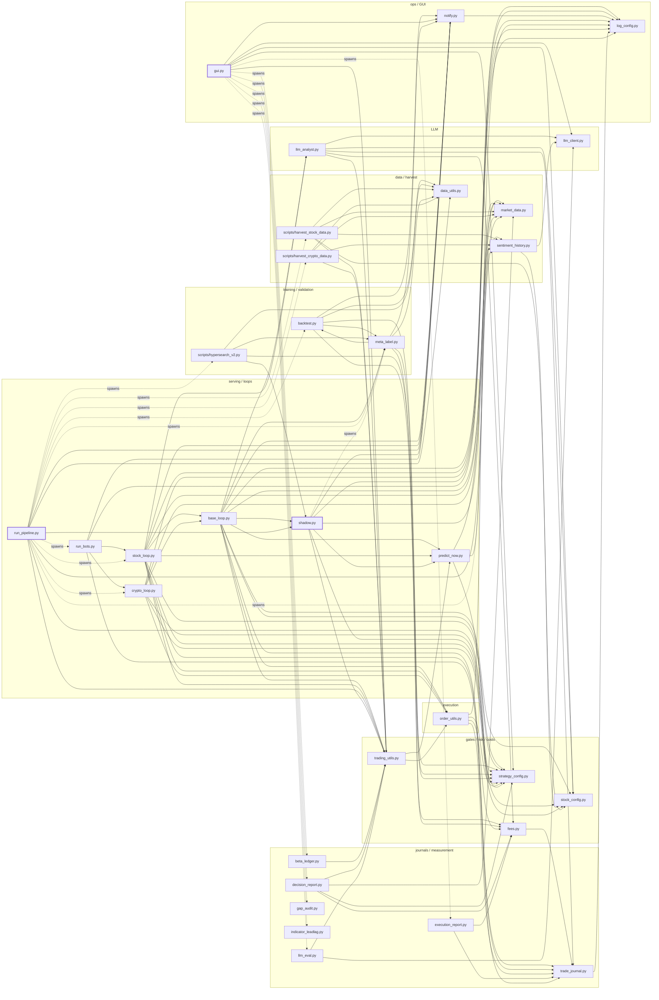

# Import / process graph

`docs/graphs/import_graph.json` is a mechanical, per-module fact sheet for every `*.py` at the
repo root and under `scripts/` (plus the two `.claude/` Python assets), generated by
`scripts/repo_graph.py` — pure `ast`/`pathlib`/`json`/`re` (stdlib only, Mac-runnable). It answers
"who imports whom", "which imports are safe to break a cycle", "which modules are Mac-importable
without torch/lightgbm/...", "which modules are CLI entry points and what flags do they take", and
"who spawns what OS process" — without importing a single repo module or third-party package.

## What's in the JSON

Top-level shape: `{modid: record, ...}` for every non-test module (114 as of 2026-09-08). A
`modid` is the repo-relative POSIX path, e.g. `backtest.py` or `scripts/hypersearch_v2.py` — this
is also how every cross-reference field below names another module. Test modules (`tests/*.py`)
are analysed (their imports resolve edges and populate `imported_by`/`imported_by_tests`) but are
**not** given their own top-level record.

### Record schema (one line per field)

| field | meaning |
|---|---|
| `modid` | repo-relative POSIX path; also the record's key in the JSON |
| `kind` | `toplevel` (repo-root `*.py`), `script` (`scripts/*.py`), or `claude-asset` (the two `.claude/` Python assets) |
| `docstring` | the module's first docstring line (`""` if none) |
| `loc` | line count of the file, including blank/comment lines |
| `sloc` | source line count — blank lines and full-line comments excluded |
| `bytes` | file size in bytes |
| `tracked_by_git` | whether `git ls-files` lists this path (`false` for untracked files, and always `false` if git is unavailable) |
| `imports_internal` | sorted, deduplicated list of modids this module imports |
| `imports_internal_detail` | one entry per individual import statement/name: `module`, `form` (`import`/`from`), `line`, `function_local`, `try_guarded`, `handlers`, `if_guarded`, `resolves_to`, and (for `from` imports) `names` |
| `imports_internal_lazy` | subset of `imports_internal` imported ONLY inside a function body, never at module top level |
| `imports_internal_eager` | subset of `imports_internal` imported at module level and NOT inside a `try:` — the edges Python actually walks at import time |
| `imports_external` | sorted, deduplicated head names of external (stdlib + third-party) imports, e.g. `torch` not `torch.nn` |
| `imports_external_detail` | same per-statement shape as `imports_internal_detail`, for imports that did not resolve internally |
| `imported_by` | sorted list of every repo module (prod code or test) that imports this one |
| `imported_by_nontest` | `imported_by` restricted to non-test modules |
| `imported_by_tests` | `imported_by` restricted to `tests/*.py` |
| `fan_in` | `len(imported_by_nontest)` — the ranking/headline number |
| `fan_out` | `len(imports_internal)` |
| `is_entry_point` | `true` if the module has an `if __name__ == "__main__":` block |
| `argparse_flags` | one entry per `add_argument(...)` call: `names` plus whichever of `default`/`action`/`type`/`choices`/`required`/`nargs`/`dest` were passed (unparsed source text) |
| `heavy_deps` | one entry per external import matching the heavy/extra-Mac-missing dep lists: `dep`, `module`, `line`, guard flags, `guarded` (bool), `class` (`heavy` or `extra-mac-missing`) |
| `heavy_unguarded` | sorted set of `dep` names from `heavy_deps` with NO guard — `import <module>` raises on the dev Mac |
| `heavy_guarded` | sorted set of `dep` names from `heavy_deps` that ARE guarded (function-local or `try:`-wrapped) |
| `file_literals` | sorted list of quoted string constants (incl. f-string templates, `{expr}` marking the dynamic part) ending in a data-file extension |
| `parquet_io` | line numbers of `to_parquet`/`read_parquet`/`to_feather`/`read_feather` call sites — an invisible `pyarrow` dependency AST import analysis alone can't see |
| `process` | spawn/thread/process detection: `spawns`, `threads`, `mp`, `uses_sys_executable` (bool), `cmd_literals`, `spawn_targets` (`.py` filenames extracted from command-vector literals) |
| `referenced_by_string` | sorted list of modules that name THIS one as a plain string constant (dynamic `importlib.import_module(...)`, subprocess-by-path, `sys.modules[...]` stubs) |
| `string_refs` | sorted list of OTHER modules THIS one names as a plain string constant (the reverse of `referenced_by_string`) |

Heavy deps tracked: `torch, lightgbm, optuna, joblib, numba, sklearn, dotenv, alpaca*, finnhub,
PySide6, pyqtgraph` (class `heavy`), plus `pyarrow, arch, hmmlearn, statsmodels` (class
`extra-mac-missing` — also absent on the dev Mac but not part of the strict "heavy" set; see
CLAUDE.md's two-machine table).

## Regenerating

```bash
python3 scripts/repo_graph.py --json                # writes docs/graphs/import_graph.json
python3 scripts/repo_graph.py --json --summary       # + prints the tables below to stdout
python3 scripts/repo_graph.py --out /tmp/somewhere --json   # write elsewhere instead
```

The JSON is **byte-deterministic**: re-running with nothing changed in the repo reproduces an
identical file (all dict keys are alphabetized via `json.dump(..., sort_keys=True)`; every list
field is either explicitly sorted or derived from a fixed AST walk order over unchanged source).
Verified by running `--json` twice back-to-back and diffing (`md5` identical both times).

## `--check` — a cheap, mechanical invariant

```bash
python3 scripts/repo_graph.py --check
```

Exits **1** if either of two structural invariants breaks, **0** otherwise:

1. **No unreachable module** — every `.py` under the analysed roots must be imported by
   something (prod code or a test) OR be a runnable `__main__` entry point. A module with neither
   is dead weight.
2. **No EAGER import cycle** — a circular import that Python would actually hit at import time
   (module-level, non-`try:`-guarded edges only). A cycle broken by a lazy/`try:`-guarded import on
   at least one side is fine and does not trip this check — that is exactly how this repo's one
   mutual pair, `backtest.py` <-> `meta_label.py`, is safely broken today (both directions are
   function-local imports).

Both invariants hold today (see the summary below). This is cheap enough (a few seconds, no
dependencies) to run as an ab_check-adjacent gate before any change that adds/removes/reorders
imports — wire it in alongside `bash scripts/ab_check.sh` rather than as a replacement for it: the
two check different things (ab_check diffs test pass/fail *names* against
`tests/baseline_failures.txt`; `repo_graph.py --check` verifies the import graph's own shape).

## `--summary` output (dated 2026-09-08)

Pasted verbatim from `python3 scripts/repo_graph.py --json --summary`, run against this repo
after `scripts/repo_graph.py` and `tests/test_repo_graph.py` themselves were added — which is why
the module/edge/entry-point counts here are exactly one higher than the pre-existing D13 discovery
pass (113 -> 114 modules, 46 -> 47 entry points): the tool now also analyses itself, correctly,
as one more `scripts/*.py` entry point that imports nothing internal.

```text
==============================================================================
repo_graph.py -- import/process graph summary
==============================================================================
analysed modules       : 114 (toplevel=91, scripts=21, claude=2)
test modules scanned   : 200
parse errors           : 0
internal edges         : 298
entry points (__main__): 47
imported by tests only : 28
imported by NOTHING    : 9 (of which unreachable/non-entry-point: 0)
import cycles, ALL edges (SCC>1) : 1 [['backtest.py', 'meta_label.py']]
import cycles, EAGER edges only  : 0 
max import depth       : 9
heavy dep, unguarded    : 9 modules
heavy dep, guarded-only : 18 modules
heavy dep, transitively unimportable : 12 modules
process-spawning modules : 7 -> ['gui.py', 'notify.py', 'order_stream.py', 'run_bots.py', 'run_pipeline.py', 'scripts/repo_graph.py', 'shadow.py']
top fan-in              : [('log_config.py', 22), ('strategy_config.py', 21), ('data_utils.py', 13), ('market_data.py', 12), ('stock_config.py', 12), ('trading_utils.py', 12), ('fees.py', 9), ('notify.py', 9)]
top fan-out             : [('base_loop.py', 28), ('stock_loop.py', 20), ('scripts/hypersearch_v2.py', 14), ('backtest.py', 13), ('gui.py', 13), ('scripts/harvest_stock_data.py', 13), ('scripts/harvest_crypto_data.py', 12), ('llm_analyst.py', 11)]
file literals (total)  : 269 across 64 modules
```

Note on `scripts/repo_graph.py` appearing in the process-spawning list: it is a correctly-computed
(if slightly self-referential) artifact of the `uses_sys_executable` heuristic, which does a plain
substring search for the literal text `"sys.executable"` in each file's source — and
`repo_graph.py`'s own source contains that literal (as the substring it searches FOR, in
`collect_processes`). It does not actually invoke `sys.executable` anywhere. Harmless, and not
something `--check` cares about (it only checks reachability and eager cycles).

### Fan-in top 25

| # | module | fan-in | (+tests) | fan-out | loc | entry? |
|---|---|---:|---:|---:|---:|---|
| 1 | `log_config.py` | 22 | +2 | 0 | 69 |  |
| 2 | `strategy_config.py` | 21 | +32 | 0 | 653 |  |
| 3 | `data_utils.py` | 13 | +5 | 0 | 454 |  |
| 4 | `market_data.py` | 12 | +15 | 1 | 705 |  |
| 5 | `stock_config.py` | 12 | +6 | 0 | 218 |  |
| 6 | `trading_utils.py` | 12 | +6 | 3 | 332 |  |
| 7 | `fees.py` | 9 | +18 | 1 | 273 |  |
| 8 | `notify.py` | 9 | +9 | 1 | 274 |  |
| 9 | `adaptive_config.py` | 8 | +6 | 0 | 578 |  |
| 10 | `llm_client.py` | 8 | +6 | 1 | 1626 |  |
| 11 | `llm_config.py` | 8 | +5 | 0 | 340 |  |
| 12 | `trade_journal.py` | 7 | +12 | 2 | 315 |  |
| 13 | `sentiment.py` | 6 | +8 | 1 | 1279 |  |
| 14 | `stage0_preds.py` | 6 | +2 | 0 | 275 |  |
| 15 | `indicators.py` | 5 | +12 | 2 | 1089 |  |
| 16 | `model_v2.py` | 5 | +2 | 0 | 42 |  |
| 17 | `policy_exits.py` | 5 | +6 | 1 | 513 |  |
| 18 | `sentiment_history.py` | 5 | +3 | 4 | 980 | yes |
| 19 | `validation.py` | 5 | +9 | 0 | 796 |  |
| 20 | `funding_archive.py` | 4 | +4 | 0 | 235 | yes |
| 21 | `indicator_config.py` | 4 | +4 | 0 | 284 |  |
| 22 | `liquidity.py` | 4 | +8 | 2 | 599 |  |
| 23 | `llm_analyst.py` | 4 | +4 | 11 | 1484 | yes |
| 24 | `meta_label.py` | 4 | +10 | 8 | 1262 | yes |
| 25 | `order_utils.py` | 4 | +15 | 5 | 1310 |  |

### Fan-out top 15

| # | module | fan-out | fan-in | loc | entry? | imports |
|---|---|---:|---:|---:|---|---|
| 1 | `base_loop.py` | 28 | 2 | 3360 |  | `drawdown`, `fundamentals`, `hw_monitor`, `llm_analyst`, `llm_config`, `log_config`, `macro_calendar`, `macro_indicators`, `market_data`, `meta_label`, `monitor_drift`, `notify`, `novelty`, `order_stream`, `order_utils`, `portfolio`, `predict_now`, `regime_detector`, `risk_budget`, `sentiment`, `shadow`, `stock_config`, `strategy_config`, `trade_journal`, `trade_memory`, `trading_utils`, `types_mod`, `volatility` |
| 2 | `stock_loop.py` | 20 | 1 | 1640 | yes | `base_loop`, `edgar_events`, `events_calendar`, `fundamentals`, `llm_analyst`, `log_config`, `macro_indicators`, `market_data`, `notify`, `order_utils`, `panel_ranks`, `portfolio`, `predict_now`, `sentiment`, `stock_config`, `strategy_config`, `trade_journal`, `trade_memory`, `trading_utils`, `types_mod` |
| 3 | `scripts/hypersearch_v2.py` | 14 | 1 | 3047 | yes | `adaptive_config`, `blend_fit`, `data_utils`, `gpu_lock`, `indicator_config`, `meta_label`, `model_lgb`, `model_v2`, `objective_utils`, `retrain_ledger`, `sample_weights`, `shadow`, `strategy_config`, `validation` |
| 4 | `backtest.py` | 13 | 2 | 1437 | yes | `adaptive_config`, `data_utils`, `fees`, `liquidity`, `meta_label`, `model_lgb`, `model_v2`, `notify`, `policy_exits`, `sample_weights`, `stage0_preds`, `strategy_config`, `validation` |
| 5 | `gui.py` | 13 | 0 | 10537 | yes | `chart_core`, `design_tokens`, `hw_monitor`, `indicator_config`, `journal_stats`, `llm_client`, `llm_config`, `notify`, `sentiment`, `stock_config`, `strategy_config`, `tax_lots`, `trading_utils` |
| 6 | `scripts/harvest_stock_data.py` | 13 | 0 | 577 | yes | `adaptive_config`, `cost_regime`, `data_sources`, `data_utils`, `indicators`, `liquidity`, `market_data`, `panel_ranks`, `policy_exits`, `sentiment_history`, `short_flow`, `stock_config`, `trading_utils` |
| 7 | `scripts/harvest_crypto_data.py` | 12 | 0 | 405 | yes | `adaptive_config`, `cost_regime`, `data_sources`, `data_utils`, `funding_archive`, `indicators`, `liquidity`, `market_data`, `oi_archive`, `policy_exits`, `sentiment_history`, `trading_utils` |
| 8 | `llm_analyst.py` | 11 | 4 | 1484 | yes | `events_calendar`, `fees`, `fundamentals`, `llm_client`, `llm_config`, `macro_calendar`, `sentiment`, `stock_config`, `trade_journal`, `trade_memory`, `trading_utils` |
| 9 | `predict_now.py` | 11 | 4 | 585 | yes | `funding`, `indicators`, `market_data`, `model_lgb`, `model_v2`, `oi_archive`, `prediction_cache`, `sentiment_history`, `serving_cache`, `short_flow`, `strategy_config` |
| 10 | `run_pipeline.py` | 10 | 0 | 1838 | yes | `adaptive_config`, `data_utils`, `hw_monitor`, `journal_stats`, `monitor_drift`, `notify`, `sentiment_history`, `shadow`, `strategy_config`, `trading_utils` |
| 11 | `crypto_loop.py` | 8 | 1 | 318 | yes | `base_loop`, `funding`, `log_config`, `market_data`, `order_utils`, `sentiment`, `stock_config`, `strategy_config` |
| 12 | `meta_label.py` | 8 | 4 | 1262 | yes | `backtest`, `calibration`, `data_utils`, `fees`, `liquidity`, `notify`, `policy_exits`, `strategy_config` |
| 13 | `scripts/window_ab.py` | 8 | 0 | 475 | yes | `adaptive_config`, `blend_fit`, `data_utils`, `gpu_lock`, `model_v2`, `objective_utils`, `scripts/hypersearch_v2`, `stage0_preds` |
| 14 | `run_bots.py` | 6 | 0 | 224 | yes | `crypto_loop`, `log_config`, `monitor_drift`, `notify`, `stock_loop`, `trade_journal` |
| 15 | `scripts/meta_learning_curve.py` | 6 | 0 | 334 | yes | `backtest`, `calibration`, `data_utils`, `meta_curve`, `meta_label`, `strategy_config` |

### Entry points (47)

| module | argparse flags | one-line docstring |
|---|---|---|
| `.claude/hooks/py_compile_gate.py` | _(none)_ | Blocking PostToolUse syntax gate (stdin: Claude Code hook JSON). |
| `.claude/skills/decision-queue/render.py` | `--ledger (default=str(DEFAULT_LEDGER))`; `--severity (default=None)`; `--module (default=None)`; `--full (store_true)` | Render the 2026-07 module-review owner decision queue (stdlib only — Mac-safe). |
| `backtest.py` | `--prefix (default='')`; `--days (default=60)`; `--trials (default=None)`; `--gate (store_true)`; `--min-sharpe (default=0.0)`; `--min-dsr (default=DSR_MIN)`; `--model-prefix (default='')`; `--no-stage0-dump (store_true)`; `--fee-mult (default=None)`; `--fee-sweep (default=None)` | Event-driven backtest of the ACTUAL trading policy, net of real costs. |
| `basis_archive.py` | `--start (default='2020-01')` | Spot-perp BASIS archive — the higher-frequency carry primitive (wave-7). |
| `beta_ledger.py` | `--days (default=None)`; `--lags (default=1)`; `--equity-csv`; `--benchmarks-csv`; `--json` | Beta ledger — how much of the strategy's P&L is market exposure? |
| `crypto_loop.py` | _(none)_ | 24/7 crypto trading loop — subclass of BaseTradingLoop. |
| `decision_report.py` | `--days (default=30)` | Gate attribution + conviction calibration from the decision journals. |
| `edgar_events.py` | _(none)_ | SEC EDGAR corporate-event entry veto (8-K items + pending M&A). |
| `execution_report.py` | `--days (default=14)` | Implementation-shortfall report — what execution actually costs. |
| `funding_archive.py` | `--start (default='2020-01')` | Historical perp funding rates from Binance public archives (training data). |
| `gap_audit.py` | `--symbols`; `--notional (default=5000.0)`; `--stop-frac (default=0.02)`; `--json (default=None)` | Overnight forfeited-drift + GTC gap-through audit (wave-7, overlay decision). |
| `gui.py` | _(none)_ | PySide6 Trading Dashboard for Alpaca paper trading system. |
| `hw_monitor.py` | _(none)_ | Hardware monitoring utilities for Jetson Orin Nano 8GB. |
| `indicator_leadlag.py` | `--data`; `--preset (default='stationary')`; `--features (default=None)`; `--horizons (default='1,4,12,24,48')`; `--fdr-q (default=0.1)`; `--json` | Leading/lagging indicator diagnostic + redundancy clusters (2026-07). |
| `llm_analyst.py` | _(none)_ | Pre-trade LLM qualitative conviction scorer. |
| `llm_eval.py` | `--days (default=14)`; `--asset (default=None)`; `--advisor (store_true)` | Measure whether the LLM gate adds signal BEYOND the ML model. |
| `meta_label.py` | `--prefix (default='')`; `--no-publish (store_true)`; `--promote-staged (store_true)` | Meta-labeling: a second model that sizes/vetoes the first one's trades. |
| `monitor_drift.py` | `--prefix (default=None)` | PSI drift monitor — detect when live predictions leave the training |
| `oi_archive.py` | `--start (default=OI_START)`; `--max-files (default=MAX_FILES_PER_SYNC)` | Open-interest features from Binance public archives + live OKX serving. |
| `options_overlay.py` | `--symbols (default=sorted(SYMBOL_TIERS))`; `--period (default='2y')`; `--dte (default=1)`; `--width-frac (default=0.05)`; `--puts (store_true)`; `--out (default='options_overlay_verdict.json')` | Free, offline option-pricing + cost-realism harness for the overnight overlay. |
| `predict_now.py` | _(none)_ | ML prediction engine — RegressionLSTM loading, JIT tracing, live predictions. |
| `run_bots.py` | `--crypto-only (store_true)`; `--stock-only (store_true)` | Combined bot runner — crypto + stock loops as threads in ONE process. |
| `run_pipeline.py` | `--trials (default=200)`; `--bot-only (store_true)`; `--skip-harvest (store_true)`; `--crypto-only (store_true)`; `--stock-only (store_true)`; `--no-retrain (store_true)`; `--retrain-day (default=5)`; `--retrain-hour (default=2)`; `--retrain-trials (default=100)`; `--combined-bots (store_true)` | Overnight pipeline: train models, start trading, auto-retrain weekly. |
| `scripts/connection_test.py` | _(none)_ | Alpaca API connection test — verifies credentials and reports account status. |
| `scripts/crypto_spread_census.py` | `--minutes (default=60)`; `--interval (default=5.0)`; `--loc (default='us')`; `--symbols (default=None)`; `--out (default='crypto_spread_census.json')` | Crypto venue spread census (B05.1 / NEW-opportunity #1). |
| `scripts/cscv_audit.py` | `--blocks`; `--returns`; `--n-blocks (default=8)`; `--n-groups (default=8)`; `--pbo-max (default=0.5)` | Offline CSCV Probability-of-Backtest-Overfitting audit (wave-8 #2). |
| `scripts/entry_timing_probe.py` | `--preds`; `--prefix (default='')`; `--journal-dir (default=str(BASE_DIR / 'journals'))`; `--n-boot (default=500)`; `--seed (default=0)` | M1 entry-timing probe (R2C-06d, measurement-only) — MEASURE-FIRST for |
| `scripts/funding_drift_audit.py` | `--split (default='2026-01-01')`; `--trailing-days (default=90)`; `--fwd-bars (default=None)`; `--out (default=str(BASE_DIR / 'research/funding_drift_2026-08.json'))` | FR-03 funding-feature regime-shift audit (R2C-06c, measurement-only). |
| `scripts/harvest_crypto_data.py` | _(none)_ | Harvest crypto training data — Alpaca + yfinance + CryptoCompare hourly OHLCV. |
| `scripts/harvest_stock_data.py` | _(none)_ | Harvest stock training data — Alpaca + yfinance hourly OHLCV. |
| `scripts/horizon_transfer_report.py` | `--prefix (default='')`; `--n-boot (default=200)`; `--seed (default=0)`; `--stride (default=None)`; `--per-name (store_true)` | FR-07-A driver — horizon-transfer curves from harvest labels (R2C-06b). |
| `scripts/hypersearch_v2.py` | `--trials (default=NUM_TRIALS)`; `--fresh (store_true)`; `--data (default='training_data.csv')`; `--prefix (default='')`; `--shadow (store_true)`; `--preset (default=None)`; `--max-rows (default=500000)`; `--mode (default='')`; `--no-status (store_true)` | Regression-based Optuna hyperparameter search with walk-forward cross-validation. |
| `scripts/ic_by_name.py` | `--in`; `--name-key (default='symbol')`; `--pred-key (default='pred')`; `--fwd-key (default='fwd_return')`; `--time-key (default=None)`; `--min-ic (default=0.0)`; `--min-consistency (default=0.6)`; `--min-t (default=2.0)`; `--subperiods (default=4)` | Per-name IC diagnostic — the universe-promotion gate (wave-9 #3 activation). |
| `scripts/llm_qualify.py` | `--models (default=None)`; `--n (default=DEFAULT_N_CALLS)`; `--spacing (default=DEFAULT_SPACING_S)`; `--out (default=str(OUT_DIR_DEFAULT))`; `--shadow (store_true)`; `--replay (store_true)`; `--days (default=2)`; `--max-cycles (default=6)`; `--report (store_true)` | Free-LLM qualification harness for the analyst role (c26 packet V1). |
| `scripts/meta_learning_curve.py` | `--prefix (default='')`; `--seeds (default=meta_curve.DEFAULT_N_SEEDS)`; `--block-len (default=meta_curve.DEFAULT_BLOCK_LEN)`; `--grid (default='100,200,400,800,1600,3200')`; `--eval-fraction (default=0.2)`; `--no-tiering (store_true)`; `--out (default=None)`; `--base-seed (default=meta_curve.DEFAULT_BASE_SEED)` | B04.3 learning-curve harness (campaign 2026-08, packet V3) — Jetson CLI. |
| `scripts/naive_vs_blend.py` | `--preds`; `--prefix (default='')`; `--half-life (default=nb.DEFAULT_HALF_LIFE)`; `--vol-window (default=nb.DEFAULT_VOL_WINDOW)`; `--cum-trials (default=None)` | FR-04 driver — deployed blend vs the Nagel naive one-liner (R2C-06a). |
| `scripts/prompt_ab.py` | `--days (default=14)`; `--asset (default=None)`; `--system-b (default=None)`; `--hide-pred-b (store_true)`; `--rich-context-b (store_true)`; `--model (default=None)`; `--max-cycles (default=None)`; `--sleep-sec (default=2.0)`; `--out (default=str(DEFAULT_OUT))`; `--dry-run (store_true)`; `--in`; `--min-n (default=MIN_POWER_N_DEFAULT)` | Offline prompt A/B harness for the LLM conviction gate. |
| `scripts/rank_gradient_report.py` | `--preds`; `--buckets`; `--signal-lag (default=0)`; `--cost-pct (default=0.0)`; `--fwd-bars (default=1)`; `--extra-cols (default='')`; `--strict (store_true)` | Rank-gradient Stage-0 gate (wave-9 #4/#5 activation harness). |
| `scripts/reliability_report.py` | `--in`; `--bins (default=10)` | Calibration before/after gate (wave-9 #1 activation harness). |
| `scripts/repo_graph.py` | `--out (default='docs/graphs')`; `--json (store_true)`; `--summary (store_true)`; `--check (store_true)` | repo_graph.py — mechanical import graph + process graph + entry-point census for this repo. |
| `scripts/sizing_cofire_report.py` | `--days (default=30)`; `--journal-dir (default=os.path.join(_REPO, 'journals'))`; `--book (default='all')`; `--json (store_true)` | Sizing multiplier co-fire report (c26 S3 / defects D10 / 02_research B06). |
| `scripts/train_lexicon.py` | `--db (default=str(_REPO / 'sentiment_cache.db'))`; `--data (default=str(_REPO / 'stock_training_data.parquet'))`; `--horizons (default='1,3,5')`; `--fit-horizon (default=3)`; `--start (default=None)`; `--end (default=None)`; `--min-df (default=10)`; `--screen-t (default=2.0)`; `--embargo-days (default=None)`; `--folds (default=4)`; `--lambda-grid (default='0.01,0.1,1,10,100')`; `--journal-days (default=0)`; `--no-novelty (store_true)`; `--recompute-kw (store_true)`; `--out (default=str(_REPO / 'learned_lexicon.json'))`; `--report (default=str(_REPO / 'lexicon_eval_report.json'))`; `--seed (default=0)` | Offline trainer CLI for the learned sentiment lexicon — DARK ARTIFACT. |
| `scripts/wave6_stage0.py` | `--book (default=None)`; `--fb (default=None)`; `--json (default=None)` | Wave-6 Stage-0 measurement (offline, no live data). |
| `scripts/window_ab.py` | `--prefix (default='')`; `--data (default='training_data.csv')`; `--preset (default=None)`; `--max-rows (default=500000)`; `--arms (default='full,730,365,pt2007')`; `--seed (default=42)`; `--cum-trials (default=None)`; `--epochs (default=None)`; `--out (default=None)` | FR-02 fixed-config training-window A/B runner (R2C-05, Jetson-only). |
| `sentiment_history.py` | `--backfill (store_true)`; `--fetch-stocks (store_true)`; `--stats (store_true)`; `--rpm (default=8)` | Historical sentiment data — fetch, cache, score, and background-enrich. |
| `short_flow.py` | `--days-back (default=START_DAYS_BACK)`; `--max-files (default=MAX_FILES_PER_SYNC)` | FINRA daily short-volume flow — per-name positioning features. |
| `stock_loop.py` | _(none)_ | Stock trading loop — subclass of BaseTradingLoop. |

### Unguarded heavy dependencies (9)

Top-level `import <heavy dep>` with no function-local/`try:` guard — `import <module>` raises on the dev Mac.

| module | unguarded heavy deps | line(s) |
|---|---|---|
| `gui.py` | PySide6, dotenv, pyqtgraph | 25, 35, 38, 39, 40, 50 |
| `model_v2.py` | torch | 10, 11 |
| `predict_now.py` | joblib, torch | 12, 15 |
| `scripts/connection_test.py` | dotenv | 12 |
| `scripts/harvest_crypto_data.py` | dotenv | 32 |
| `scripts/harvest_stock_data.py` | dotenv | 25 |
| `scripts/hypersearch_v2.py` | joblib, optuna, sklearn, torch | 46, 47, 48, 49, 50, 51, 52 |
| `scripts/window_ab.py` | joblib, torch | 46, 49 |
| `trading_utils.py` | dotenv | 14 |

## Main data/process flow (top-25 by fan-in + fan-out)

The diagram below is the same one produced by the one-off discovery pass this tool was built
from (`D13_graph.py`'s `mermaid()`, not reproduced by `repo_graph.py` itself — see "Scope" below).
Nodes are the 25 most-connected non-test modules (score = fan-in + fan-out), plus 7 force-added
because a spawner launches them (their import connectivity is low but they are load-bearing in
the PROCESS flow). **Solid arrows = import edges; dashed `spawns` arrows = OS child processes.**
Thick-bordered nodes are the three process spawners (`gui`, `run_pipeline`, `shadow`). Scores:
`base_loop`=30, `log_config`=22, `stock_loop`=21, `strategy_config`=21, `backtest`=15,
`llm_analyst`=15, `predict_now`=15, `scripts/hypersearch_v2`=15, `trading_utils`=15,
`data_utils`=13, `gui`=13, `market_data`=13, `scripts/harvest_stock_data`=13, `meta_label`=12,
`scripts/harvest_crypto_data`=12, `stock_config`=12, `fees`=10, `notify`=10, `run_pipeline`=10,
`crypto_loop`=9, `llm_client`=9, `order_utils`=9, `sentiment_history`=9, `shadow`=9,
`trade_journal`=9, `beta_ledger`=1, `decision_report`=5, `execution_report`=2, `gap_audit`=1,
`indicator_leadlag`=1, `llm_eval`=3, `run_bots`=6.

Reading it: `run_pipeline` is the only node that spawns the *training* chain (harvest ->
hypersearch -> meta_label -> backtest) and the *serving* chain (run_bots/crypto_loop/stock_loop)
— those are separate OS processes, not imports, which is why `run_pipeline`'s import fan-out (10)
understates its role. Conversely `base_loop` has the largest import fan-out (28) but spawns
nothing: it is the in-process Template-Method core both live loops inherit.



## Scope note

`scripts/repo_graph.py` is a trimmed, repo-suitable port of a one-off discovery script
(`D13_graph.py`) that also produced a much longer prose report — cycle-breaking narrative, layer
naming, a baseline-failures cross-check, and the mermaid diagram above. This tool keeps the
mechanical analysis (edges, cycles, heavy-dep guarding, entry points, process graph, file
literals) and the `--summary`/`--check`/`--json` surface documented above; the one-off narrative
sections (including mermaid generation) were left out as investigation-specific rather than
durable repo tooling, which is why the diagram here is a dated, hand-pasted snapshot rather than
something `--summary` regenerates. Re-derive it from `docs/graphs/import_graph.json` if it goes
stale enough to matter.
